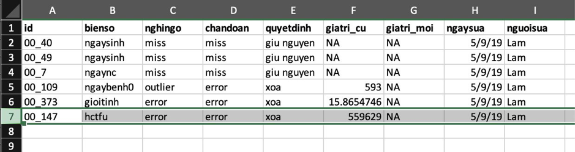

# Kiểm tra và làm sạch dữ liệu {#data_cleaning}

Đây là bước đầu tiên nên được thực hiện khi nhận được một bộ số liệu, với mục tiêu là xây dựng được bộ số liệu sạch cho phân tích. 

Sai sót hoặc dữ liệu bất thường rất thường gặp. Những sai sót này có thể bắt nguồn từ những sai sót trong quá trình thu thập dữ liệu và/hoặc quá trình nhập liệu. Một số lỗi có thể tình cờ phát hiện được trong khi phân tích, nhưng nhiều trường hợp không thể dễ dàng phát hiện và sẽ ảnh hưởng đến kết quả phân tích, thậm chí dẫn đến các sai sót trầm trọng. Vì vậy trước khi phân tích cần phải kiểm tra tính chính xác của số liệu để đảm bảo kết quả phân tích là chính xác nhất có thể.

```{r UncleanedDataset, tidy=FALSE, echo=FALSE}
dat <- data.frame(id = c("001", "002", "003", "003"),
                  ngaysinh = c("2013-05-08", "2018-12-03", "2013-12-20", "2013-12-20"),
                  ngaync   = c(NA, "2018-02-03", "2018-12-13", "2018-12-13"),
                  gioitinh = c(1, "Nữ", "Nam", "Nam"),
                  hct0     = c(49, 250, 50, 50),
                  cannang_kg  = c(10, 50, 20, 20)) %>%
  select(id, ngaysinh, ngaync, gioitinh, hct0, cannang_kg)

knitr::kable(
  dat, caption = 'Dữ liệu chưa được làm sạch',
  booktabs = TRUE
)
```


## Các nhóm lỗi dữ liệu thường gặp {#error}

Rất nhiều lỗi khác nhau có thể gặp trong dữ liệu. Tuy nhiên, có thể tóm lại thành 4 nhóm lỗi thường gặp chính:

* Dữ liệu bị thiếu/mất (missing data): khi không có dữ liệu như mong đợi, có thể do trục trặc khi thu thập dữ liệu (đối tượng nghiên cứu bỏ nghiên cứu giữa chừng/không cung cấp thông tin, nghiên cứu viên quên thu thập thông tin) hoặc khi nhập liệu (nhập liệu sót, đặc biệt với phiếu thu thập thông tin dạng nhảy câu). Trong bộ dữ liệu, dữ liệu bị thiếu/mất thường được thể hiện bằng khoảng trắng (blank) hoặc giá trị NA (not available), ví dụ như ở biến số **ngaync** của đối tượng **001** trong Bảng \@ref(tab:UncleanedDataset). 

* Dữ liệu bị lặp lại (duplicated data): khi dữ liệu từ một hay nhiều đối tượng bị lặp lại một hay nhiều lần, thường do sai sót trong quá trình nhập liệu. Trong bộ dữ liệu, dữ liệu bị lặp lại thể hiện bằng việc một hay nhiều hàng dữ liệu bị lặp lại. Ví dụ như trong Bảng \@ref(tab:UncleanedDataset), dữ liệu của đối tượng **003** bị lặp lại thêm một lần.

* Giá trị không hợp lý (out-of-range/inappropriate data): khi dữ liệu có giá trị nằm ngoài giới hạn thông thường (quá lớn hay quá bé, gặp ở các biến số liên tục) hoặc ngoài các giá trị cho phép (gặp ở các biến số phân nhóm) hoặc không phù hợp với thuộc tính của biến số (lẽ ra là giá trị số nhưng dữ liệu được nhập lại là chữ hoặc ngược lại). Đây có thể là lỗi trong quá trình thu thập dữ liệu hoặc khi nhập liệu. Ví dụ như trong Bảng \@ref(tab:UncleanedDataset), dữ liệu về **gioitinh** của đối tượng **001** được ghi nhận là **1**, trong khi đây là biến số về giới tính, vốn chỉ có hai giá trị **Nữ** hoặc **Nam**.

* Không tương hợp giữa các biến số (inconsistent data): khi dữ liệu có giá trị không phù hợp trong mối tương quan với các biến số khác trong bộ dữ liệu. Đây có thể là lỗi trong quá trình thu thập dữ liệu hoặc khi nhập liệu. Lỗi này khó phát hiện hơn so với các lỗi còn lại. Ví dụ như trong Bảng \@ref(tab:UncleanedDataset), đối tượng **002** có **ngaync** (ngày vào nghiên cứu) là 2018-02-03 (ngày 03 tháng 02 năm 2018) trong khi **ngaysinh** (ngày sinh) lại là 2018-12-03 (ngày 03 tháng 12 năm 2018), nghĩa là đối tượng tham gia nghiên cứu trước khi sinh.

## Phương pháp phát hiện lỗi {#detectmethod}

Để phát hiện các lỗi đã nêu trên, chúng ta có thể sử dụng các công cụ của thống kê mô tả, qua các chỉ số thống kê mô tả và/hoặc các biểu đồ.

### Dữ liệu bị thiếu/mất

Được phát hiện bằng cách mô tả số giá trị có trong bộ dữ liệu và so sánh với số giá trị mong đợi. Hiện nay, các phần mềm thống kê đều cho phép mô tả số giá trị bị thiếu/mất, nếu các giá trị này được mã hoá ở dạng mà các phần mềm thống kê hiểu (khoảng trắng, hoặc NA đối với R). Nếu trong giai đoạn nhập liệu, giá trị bị thiếu/mất được mã hoá theo cách khác (điền vào một giá trị nào đó, ví dụ 9, 99, 999) thì trước khi dùng phần mềm thống kê để mô tả dữ liệu, cần định dạng dữ liệu về dạng mà phần mềm thống kê hiểu.

Ở ví dụ về bộ dữ liệu trong Bảng \@ref(tab:UncleanedDataset), bằng phần mềm R, chúng ta có thể dùng lệnh `summary()` để mô tả dữ liệu. Kết quả được trình bày dưới đây cho thấy có một giá trị bị thiếu/mất (NA) ở biến số **ngaync**. 

```{r detectMissing}
summary(dat)
```

### Dữ liệu bị lặp lại

Được phát hiện bằng cách mô tả số giá trị có trong bộ dữ liệu và so sánh với số giá trị mong đợi. Lỗi này cũng có thể phát hiện bằng mắt thường khi đã xếp dữ liệu theo thứ tự của mã số nghiên cứu, hoặc mô tả biến số mã số nghiên cứu (xem số giá trị mã số nghiên cứu khác nhau). Ngoài ra, một số phần mềm thống kê có thể có câu lệnh để kiểm tra dữ liệu bị lặp lại.

Ở ví dụ về bộ dữ liệu trong Bảng \@ref(tab:UncleanedDataset), bằng phần mềm R, chúng ta có thể dùng các cách sau:

* Kiểm tra số hàng của bộ dữ liệu

```{r detectDuplication1}
nrow(dat)
```

Có `r length(unique(dat$id))` đối tượng nhưng bộ dữ liệu có `r nrow(dat)` hàng.
    
* Mô tả biến số mã số nghiên cứu (ví dụ dùng lệnh `describe()` trong package Hmisc)

```{r detectDuplication2}
Hmisc::describe(dat$id)
```

Biến số **id** (mã số nghiên cứu) có `r length(dat$id)` giá trị, nhưng chỉ có `r length(unique(dat$id))` giá trị khác nhau (nghĩa là có một giá trị bị lặp lại).
    
* Kiểm tra số đối tượng nghiên cứu bằng cách kiểm tra số giá trị mã số nghiên cứu khác nhau

```{r detectDuplication3}
length(dat$id)
length(unique(dat$id))
```

Biến số **id** (mã số nghiên cứu) có `r length(dat$id)` giá trị, nhưng chỉ có `r length(unique(dat$id))` giá trị khác nhau (nghĩa là có một giá trị bị lặp lại).
    
* Kiểm tra dữ liệu lặp lại bằng lệnh `anyDuplicated` hoặc `duplicated`

```{r detectDuplication4}
anyDuplicated(dat)
duplicated(dat)
```

Dữ liệu ở hàng thứ 4 trong bộ dữ liệu **dat** là dữ liệu lặp lại.

### Giá trị không hợp lý

Được phát hiện bằng cách mô tả tất cả các giá trị trong biến số bằng các chỉ số hoặc biểu đồ, từ đó tìm ra các giá trị khác biệt so với các giá trị còn lại của biến số.

Ở ví dụ về bộ dữ liệu trong Bảng \@ref(tab:UncleanedDataset), bằng phần mềm R, chúng ta có thể dùng các cách sau:

* Mô tả các giá trị khác nhau của biến số bằng lệnh `unique()` hoặc `table()` (chỉ thích hợp với biến số có ít giá trị khác nhau, ví dụ biến số phân nhóm)

```{r detectInappropriate1}
unique(dat$gioitinh)
table(dat$gioitinh)
```

Biến số **gioitinh** (giới tính) có 3 giá trị: `r paste(unique(dat$gioitinh), collapse = ", ")`; trong đó giá trị **1** không phù hợp.

* Mô tả khoảng giá trị, giá trị nhỏ nhất, giá trị lớn nhất để tìm các giá trị quá lớn hoặc quá bé so với mong đợi

```{r detectInappropriate2}
summary(dat$hct0)
range(dat$hct0)
min(dat$hct0)
max(dat$hct0)
```

Biến số **hct0** (dung tích hồng cầu ở thời điểm lúc mới vào nghiên cứu) có khoảng giá trị từ 49% (giá trị nhỏ nhất) đến 250% (giá trị lớn nhất), trong đó giá trị **250** là không phù hợp với giá trị mong đợi của dung tích hồng cầu.

* Mô tả giá trị bằng biểu đồ cột (với biến số phân nhóm)

```{r detectInappropriate3}
barplot(table(dat$gioitinh))
```

Biến số **gioitinh** có giá trị **1**, không phù hợp với các giá trị còn lại.

* Mô tả giá trị bằng histogram hoặc boxplot (với biến số liên tục)

```{r detectInappropriate4}
hist(dat$hct0)
boxplot(dat$hct0)
```

Biến số **hct0** có giá trị **250**, rất khác biệt so với các giá trị còn lại và nằm ngoài khoảng giá trị mong đợi cho dung tích hồng cầu.

### Không tương hợp giữa các biến số

Được phát hiện bằng cách mô tả biến số thứ cấp tạo ra từ các biến số liên quan, hoặc dùng biểu đồ mô tả mối liên hệ giữa hai biến số với nhau.

Ở ví dụ về bộ dữ liệu trong Bảng \@ref(tab:UncleanedDataset), bằng phần mềm R, chúng ta có thể dùng các cách sau:

* Mô tả biến số thứ cấp: ví dụ mô tả biến số **tuoi** (tuổi lúc vào nghiên cứu), được tính từ biến số **ngaysinh** và **ngaync**

```{r detectInconsistency1}
dat$tuoi <- as.numeric(difftime(as.Date(dat$ngaync), as.Date(dat$ngaysinh), units = "days"))
summary(dat$tuoi)
boxplot(dat$tuoi)
```

Có một trường hợp **tuoi** (tuổi lúc vào nghiên cứu) < 0.

* Dùng biểu đồ mô tả mối liên hệ giữa hai biến số **ngaysinh** và **ngaync**

```{r detectInconsistency2}
## phân tán đồ (scatterplot) của ngaysinh và ngaync
plot(x = as.Date(dat$ngaysinh), y = as.Date(dat$ngaync))
## đường thẳng qua các điểm ngaysinh bằng ngaync
abline(a = 0, b = 1)
```

Có một trường hợp **ngaync** nhỏ hơn **ngaysinh** (nằm phía dưới đường thẳng đi qua các giá trị **ngaync** bằng **ngaysinh**) trong khi mong đợi **ngaync** phải lớn hơn **ngaysinh** (đối tượng phải được sinh ra trước khi vào nghiên cứu).

## Quy trình kiểm tra và làm sạch dữ liệu

Để phát hiện và loại bỏ tối đa các sai sót có thể có nhằm có được bộ dữ liệu sạch và đáng tin cậy cho phân tích, chúng ta cần kiểm tra và làm sạch dữ liệu một cách có hệ thống theo 3 bước như sau:

### Tìm lỗi

Dựa vào các phương pháp thống kê mô tả (sử dụng chỉ số và/hoặc biểu đồ, như đã trình bày ở mục \@ref(detectmethod)) để tìm các lỗi thường gặp (như đã trình bày ở mục \@ref(error)).

Các lỗi tìm thấy nên được tổng hợp lại trong một file dữ liệu trước khi tiến hành bước tiếp theo. File dữ liệu này nên bao gồm các thông tin sau:

* Lỗi tìm thấy là gì? (loại lỗi)
* Lỗi ở đâu? (biến số liên quan, mã số nghiên cứu liên quan)

### Chẩn đoán lỗi

Trong bước này, chúng ta sẽ dựa vào kiến thức chuyên môn và hiểu biết về nghiên cứu và quá trình thu thập dữ liệu - nhập liệu trong nghiên cứu để đánh giá xem các lỗi tìm thấy trong dữ liệu có thực sự là lỗi hay không. Khi đánh giá, cần đối chiếu với dữ liệu gốc (dữ liệu thu thập trên phiếu thu thập bằng giấy) nếu có. Sau khi đánh giá, các lỗi này có thể được phân loại thành:

* Lỗi thực sự
* Không phải lỗi (chỉ là giá trị hiếm gặp) 
* Không chắc: không thể xác định có phải là lỗi không dựa vào các thông tin hiện có

### Sửa lỗi (làm sạch dữ liệu)

Tùy theo phân loại ở bước chẩn đoán lỗi, chúng ta sẽ có cách sửa lỗi phù hợp:

* Lỗi thực sự: sửa lại thành giá trị đúng (nếu có cơ sở cho giá trị đúng, ví dụ như giá trị gốc được lưu trên giấy) hoặc xoá hẳn giá trị sai (nếu không thể xác định được giá trị đúng).
* Không phải lỗi: giữ nguyên, không thay đổi giá trị trong dữ liệu.
* Không chắc: cân nhắc giữa giữ nguyên và xoá hẳn giá trị này.

Các bước trên và mọi thay đổi trong bộ dữ liệu nên được ghi nhận lại với các thông tin như:
* Lỗi tìm thấy là gì? (loại lỗi)
* Lỗi ở đâu? (biến số liên quan, mã số nghiên cứu liên quan)
* Chẩn đoán lỗi là gì?
* Người chẩn đoán lỗi?
* Quyết định đưa ra với lỗi?
* Người đưa ra quyết định?
* Nếu có sửa lỗi thì giá trị cũ là gì, giá trị mới là gì? người sửa lỗi? ngày sửa lỗi?

Vấn đề này đặc biệt quan trọng khi làm việc trong một nhóm và nhằm đảm bảo tính minh bạch và rõ ràng trong quản lý dữ liệu. Một ví dụ về file dữ liệu ghi nhận các bước liên quan đến việc kiểm tra và làm sạch dữ liệu như sau:

```{r documentclean, fig.cap="File ghi nhận việc kiểm tra và làm sạch dữ liệu", echo=FALSE}

```
