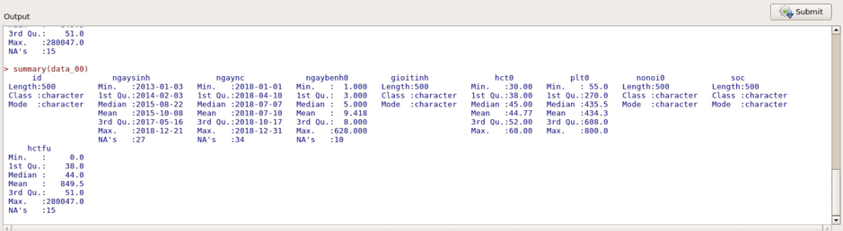

# Kiểm tra và làm sạch dữ liệu

Đây là bước đầu tiên nên được thực hiện khi nhận được một bộ số liệu. Sai sót do nhập liệu rất thường xảy ra. Một số lỗi có thể tình cờ phát hiện được trong khi phân tích, nhưng nhiều trường hợp không thể dễ dàng phát hiện và sẽ làm kết quả sai sót trầm trọng. Vì vậy trước khi phân tích cần phải kiểm tra tính chính xác của số liệu để đảm bảo kết quả phân tích là chính xác nhất có thể.

## Một số lỗi thường gặp

* Mất: Thể hiện bằng giá trị <NA>, ví dụ như ngaync của id 00_7 (hình). Thường do nhập liệu sót hoặc nhảy câu.
* Lặp lại: Một mẫu bị lặp lại hai hay nhiều lần.
* Giá trị không phù hợp: Giá trị quá lớn hay nhỏ một cách bất thường; biến lẽ ra là giá trị số nhưng lại nhập là chữ hoặc ngược lại.
* Không tương hợp giữa các biến số: Sự bất hợp lý trong logic, ví dụ ngày nghiên cứu và ngày sinh của id 00_11 trong hình. Lỗi này tương đối khó phát hiện.
    
## Phương pháp phát hiện lỗi

Dựa vào thống kê mô tả

### Bảng thống kê mô tả bằng số

    
Khi nhìn vào bảng thống kê có thể phát hiện được các lỗi thông qua giá trị lớn nhất, giá trị nhỏ nhất (giá trị không phù hợp), số <NA> (mất dữ liệu).

### Biểu đồ

Các biểu đồ thể hiện trực quan hơn, nhưng chủ yếu để xem các giá trị bất thường trong bộ dữ liệu. Biểu đồ không thể hiện được các giá trị bị mất.

## Chẩn đoán lỗi

Sau khi phát hiện được các giá trị nghi ngờ là lỗi, nên tổng hợp lại thành một bảng chung. Điều này giúp không bỏ sót lỗi và có thể góp phần gợi ý nguyên nhân cho một số lỗi có liên quan đến nhau. Có thể trình bày bảng theo ví dụ sau:

Cần kiến thức chuyên môn để chẩn đoán được các giá trị bất thường trong bảng số liệu có thực sự là lỗi hay không.
    + Lỗi thực sự
    + Không phải lỗi 
    + Không chắc: Chưa thể xác định

## Sửa lỗi

Tùy theo chẩn đoán có thực sự là lỗi hay không, và mức độ có thể khắc phục được lỗi, có thể thực hiện sửa lỗi theo 3 cách: sửa số liệu bị sai thành số liệu chính xác, xoá hẳn số liệu, hoặc không thay đổi.

Mọi thay đổi trong bộ dữ liệu đều phải được ghi nhận lại với các thông tin như ai là người đã thay đổi dữ liệu, vào thời điểm nào. Vấn đề này đặc biệt quan trọng khi làm việc trong một nhóm.

Sau khi kiểm tra đầy đủ, cập nhật thay đổi trong bộ dữ liệu gốc.

