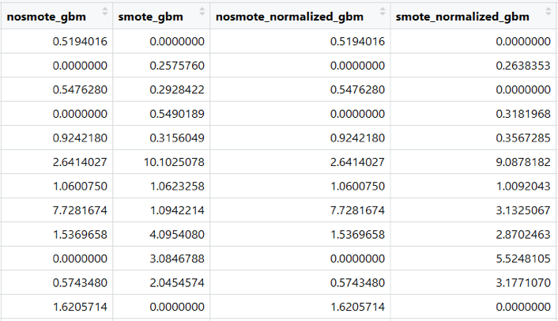
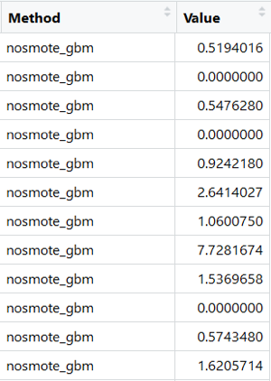

# Chuẩn bị dữ liệu cho phân tích

Dữ liệu sau khi làm sạch có thể chưa phân tích được ngay, mà cần phải biến đổi để phù hợp với mục tiêu và kỹ thuật phân tích.

## Tạo thêm biến số mới

Tạo thêm biến số mới dựa trên các biến số sẵn có: Ví dụ thu thập ngày tháng năm sinh, cần tạo thêm biến số là tuổi; hoặc thu thập cân nặng và chiều cao, cần tạo thêm biến BMI để phân tích.

## Định dạng biến số 

(phần này em không chắc là trình bày nội dung gì)

## Chuyển dạng dữ liệu cho phù hợp với phân tích

### Kết hợp các bảng dữ liệu với nhau

Dữ liệu có thể nằm ở nhiều tập tin khác nhau hoặc do nhiều người nhập liệu, cần phải ghép lại thành một bảng dữ liệu hoàn chỉnh để có đầy đủ thông tin phục vụ cho việc phân tích.

### Dữ liệu dạng dài hay dạng rộng

Ví dụ ta có bảng dữ liệu như sau gồm 4 cột:

Ta có thể biến đổi dữ liệu từ có 4 cột này thành chỉ có 2 cột như sau:

Các giá trị trong cột Method là nosmote_gbm, smote_gbm, nosmote_normalized_gbm, smote_normalized_gbm chính là tên của 4 cột ban đầu. Giá trị trong cột Value là những con số tương ứng với mỗi phương pháp trong Method. Việc biến đổi này không làm mất đi thông tin trong bộ dữ liệu mà chỉ làm thay đổi hình dạng trình bày thông tin. Dữ liệu to bè theo chiều ngang (gồm nhiều cột) gọi là dữ liệu dạng rộng (wide format). Dữ liệu sau khi biến đổi chỉ có 2 cột nhưng sẽ kéo dài xuống thành rất nhiều dòng gọi là dữ liệu dạng dài (long format).
