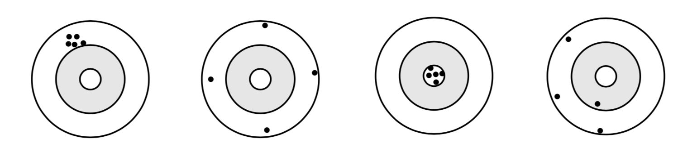
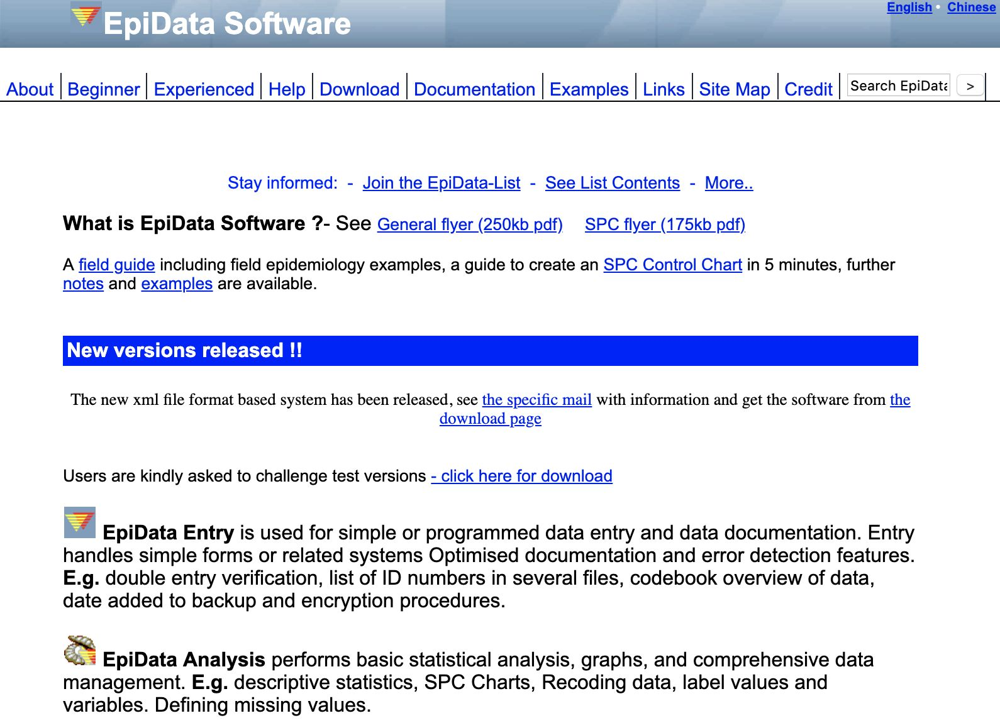
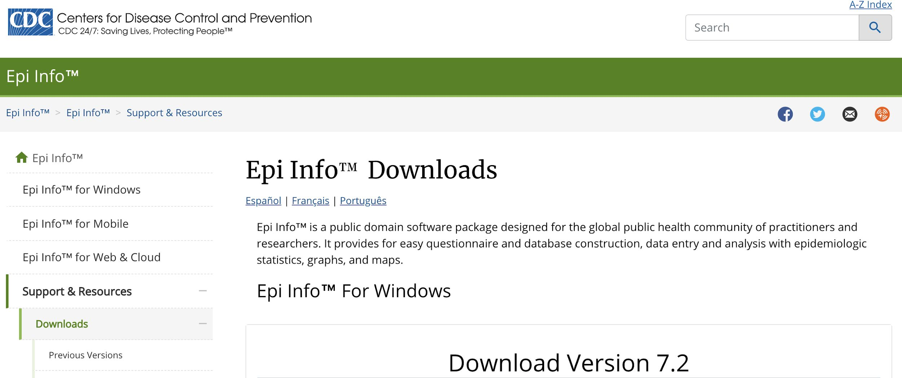
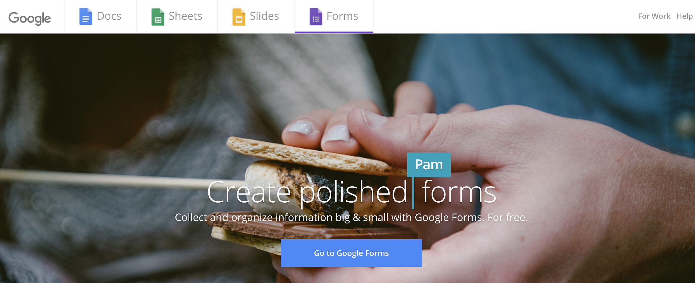

# Thu thập dữ liệu

## Thiết kế case report form (CRF)

CRF hay còn gọi là phiếu điều tra, là công cụ dùng để thu thập các thông tin cần thiết cho nghiên cứu. Thiết kế CRF cần đảm bảo cả về mặt nội dung lẫn hình thức, để thu được dữ liệu đầy đủ và chính xác nhất có thể, phục vụ cho quá trình phân tích và diễn giải kết quả sau đó.

### Nội dung

**Lựa chọn biến số**

* Việc lựa chọn biến số thu thập cần phải đảm bảo điều kiện tiên quyết là đủ thông tin để trả lời được cho câu hỏi nghiên cứu và thực hiện được mục tiêu nghiên cứu đã đề ra từ đầu. Cân nhắc số lượng biến số để không quá nhiều sẽ làm lãng phí thời gian và nguồn lực dành ra để thu thập biến số, nhưng cũng không quá ít vì có khả năng sẽ không đủ thông tin khi phân tích.

* Một số lưu ý khi thu thập các thông tin nhận dạng được (identifiable information):

  + Các thông tin nhận dạng được là những dữ liệu có thể dùng để biết được bệnh nhân là ai, là một đối tượng cụ thể nào. Các thông tin này bao gồm: tên, địa chỉ, điện thoại, số chứng minh nhân dân hoặc hộ chiếu, mã số bệnh án, số thẻ bảo hiểm y tế. Thông thường, việc thu thập và lưu trữ các thông tin nhận dạng được cần phải thông qua và giải trình trước hội đồng y đức về mục đích và phương pháp bảo mật.
  
  + Mục đích: Cân nhắc mục đích thu thập các thông tin này là gì? Có nhất thiết cần phải thu thập những thông tin này hay không? Trong đa số các trường hợp, nếu không thu thập các thông tin nhận dạng mà không ảnh hưởng gì đến việc phân loại bệnh nhân hoặc có giải pháp thay thế thì không nên thu thập thông tin nhận dạng.
  
  + Lưu ý khi lưu trữ hoặc chuyển dữ liệu cho người khác: Các thông tin nhận dạng được là dữ liệu hết sức nhạy cảm, vì vậy cần phải có phương pháp đặc thù trong việc lưu trữ thông tin. Trong quá trình lưu trữ, cần đảm bảo chỉ những thành viên nhất định trong nhóm nghiên cứu có thể tiếp cận được những thông tin này, và giữ gìn để thông tin không bị lọt ra bên ngoài. Khi chuyển dữ liệu cho người khác có thể cần phải mã hóa các thông tin nhận dạng hoặc chỉ gửi những phần dữ liệu không chứa thông tin nhận dạng để bảo mật cho bệnh nhân và không vi phạm y đức.

**Cách lấy dữ liệu cho từng biến số**

**Dạng biến số**

* Như đã đề cập trong mục Biến số ở Chương 4, biến số thường được phân nhóm thành 4 loại biến số chính gồm: biến nhị giá, biến phân nhóm, biến thứ tự và biến liên tục. Mỗi loại biến số có đặc tính và chứa một lượng thông tin khác nhau. Tuy nhiên, cùng một biến số có thể được thu thập theo nhiều cách khác nhau. Ví dụ ta có thể thu thập biến Hct theo 3 cách như sau:

  + Biến liên tục: 20.9 23.1 29.9 30.0 39.4 44.1 45.9 62.8 69.3 75.0

  + Biến thứ tự: <30%, 30-40%, 40-50%, 50-60%, >60%

  + Biến nhị giá: Cao (Hct > 50%), Thấp (Hct <= 50%)

* Dễ thấy hàm lượng thông tin chứa trong mỗi loại biến số giảm dần theo thứ tự sau: Biến liên tục > Biến phân nhóm có thứ tự > Biến phân nhóm không thứ tự > Biến nhị giá. Trong mọi trường hợp có thể thu thập được biến số dưới dạng biến liên tục thì nên thu thập luôn chứ không nên phân nhóm ra. Việc phân nhóm có thể thực hiện khi phân tích. Biến liên tục có thể phân nhóm nhưng biến phân nhóm không thể chuyển ngược trở lại thành biến liên tục được.


**Độ tin cậy (Precision/Reliability) và tính giá trị (Accuracy/Validity)**

Độ tin cậy là sự hằng định (consistency) hay mức độ ổn định của một đo lường qua nhiều lần đo khác nhau. Nói cách khác, khi lặp lại việc đo lường hay thu thập một dữ liệu (với điều kiện là dữ liệu này không thay đổi nhiều theo thời gian, ví dụ như đo lại chiều cao của người trưởng thành sau 1 tháng) trên chính đối tượng đó thêm một lần nữa, thì một CRF tốt sẽ cho kết quả không sai khác quá mức so với lần đầu tiên. Còn tính giá trị là khả năng một bộ công cụ có thể đo được vấn đề mà nó được tạo ra để đo lường. Độ tin cậy và tính giá trị được thể hiện qua hình sau:

```{r echo = F}

```

Ở bia bắn thứ nhất, sau 5 lần bằn, các lỗ đạn không trúng hồng tâm nhưng nằm rất gần nhau. Đây là ví dụ cho một công cụ có độ tin cậy cao, nhưng tính giá trị không cao (không trúng vào hồng tâm).

Ở bia bắn thứ hai, sau 4 lần bắn, các lỗ đạn nằm rất xa nhau tuy nhiên tất cả đều nằm rất gần mép của tấm bia. Nếu mục tiêu là bắn vào mép của tấm bia thì đây là ví dụ cho thấy công cụ có tính giá trị cao (bắn được vào mục tiêu) nhưng độ tin cậy thấp (kết quả đo sau nhiều lần lặp lại không thống nhất).

Ở bia bắn thứ ba, sau 5 lần bắn, các lỗ đạn vừa trúng vào hồng tâm (mục tiêu cần đo), vừa rất ổn định (cả 5 lần bắn đều trúng vào hồng tâm). Đây là ví dụ cho một công cụ vừa có độ tin cậy cao, vừa có tính giá trị cao.

Ở bia bắn cuối cùng, sau 4 lần bắn, các lỗ đạn vừa không trúng vào một mục tiêu cụ thể nào, vừa nằm rải rác xa nhau không có tính ổn định (có lỗ thì ở mép tấm bia, có lỗ thì xích vào gần hồng tâm). Đây là ví dụ cho một công cụ vừa có độ tin cậy thấp, vừa có tính giá trị thấp.

```{r echo = F}
Reliability <- c("Khả năng lặp lại (reproducibility)",
                 "Random error (chance)",
                 "Khả năng ước tính số đo",
                 "Người quan sát/lấy số liệu: cần đào tạo, tập huấn kỹ năng",
                 "Đối tượng: kỹ thuật/bản chất -> lựa chọn, lặp lại",
                 "Công cụ thu thập: thiết kế rõ ràng, đơn giản, hạn chế sai sót")
Validity <- c("Đo được cái muốn đo",
              "Systematic error (bias)",
              "Giá trị của kết luận",
              "Người quan sát/lấy số liệu: làm mù, SOP, tập huấn",
              "Đối tượng: khách quan",
              "Công cụ thu thập: calibration, phù hợp")
df <- as.data.frame(cbind(Reliability, Validity))
knitr::kable(df)
```


### Hình thức

## Phương pháp thu thập dữ liệu

Hiện nay có thể thu thập dữ liệu trên giấy hoặc điện tử (thông qua các biểu mẫu thiết kế sẵn mà người thu thập có thể truy cập thông qua máy tính bảng, điện thoại).

## Nhập liệu

Có nhiều phần mềm nhập liệu khác nhau, nhưng tất cả đều tiến hành theo ba bước cụ thể: tạo form để nhập liệu, nhập liệu vào form này, trích xuất dữ liệu. Việc sử dụng các phần mềm nhập liệu thay vì nhập trực tiếp vào bảng như Excel có ưu điểm là thiết kế trực quan và các chức năng giúp hạn chế sai sót cho người sử dụng. Những phần mềm nhập liệu phổ biến thường được sử dụng hiện nay:

**Epidata**

```{r echo = F}

```

Epidata là phần mềm miễn phí và được sử dụng phổ biến nhất hiện nay. Epidata có thể xuất ra nhiều loại file data phổ biến tương thích với các phần mềm phân tích thống kê thông dụng. Có thể tải về tại: https://www.epidata.dk/

**Epi Info**

```{r echo = F}

```

Có thế tải về tại: https://www.cdc.gov/epiinfo/support/downloads.html

**Google Form**

```{r echo = F}

```


