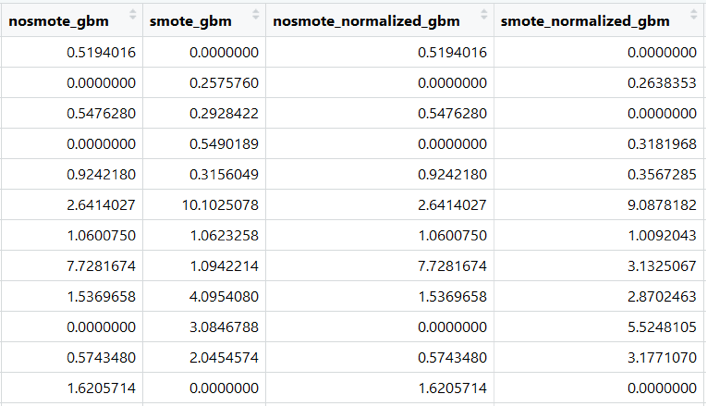

--- 
title: "Phân tích số liệu cơ bản"
author: "Phùng Khánh Lâm, Ong Phúc Thịnh"
date: "`r Sys.Date()`"
site: bookdown::bookdown_site
output: bookdown::gitbook
documentclass: book
bibliography: [book.bib, packages.bib, refs.bib]
biblio-style: apalike
link-citations: yes
github-repo: orientrcu/book_da_basic
description: "This is a minimal example of using the bookdown package to write a book. The output format for this example is bookdown::gitbook."
---

```{r setup2, echo=FALSE}
library(tidyverse)
library(lubridate)
library(C306)
library(ggplot2)
knitr::opts_chunk$set(out.width = '80%', fig.asp = .75, fig.align = 'center', warning = FALSE, message = FALSE) 
data_path <- file.path("data", "journal.pntd.0005498.s003")
baseline <- read.csv(file.path(data_path, "baseline.csv"))
plt <- read.csv(file.path(data_path, "baseline.csv"))
```

# Lời nói đầu {-}

Test

## Nội dung dự kiến

* Vì sao có cuốn sách này?
* Mục tiêu
* Đối tượng
* Phương pháp:
    + Lý thuyết kết hợp với ví dụ thực tế
    + Thực hành: R commander
* Đóng góp của nhóm tác giả

## Dữ liệu sử dụng trong sách

Để minh hoạ cho các nội dung được trình bày, chúng tôi sử dụng các ví dụ thực tế, được phân tích bằng phần mềm R, trên bộ dữ liệu của một đoàn hệ tiền cứu trên trẻ nhập viện với chẩn đoán lâm sàng là sốt xuất huyết tại Bệnh viện Bệnh Nhiệt đới TP HCM từ năm 2001 đến năm 2009. Bộ dữ liệu này được công bố cùng với bài báo trình bày kết quả phân tích của nghiên cứu này [@Lam_2017]. Truy cập website của bài báo <https://journals.plos.org/plosntds/article?id=10.1371/journal.pntd.0005498> để tải về bộ dữ liệu này.


<!--chapter:end:index.Rmd-->

# Giới thiệu về phân tích dữ liệu {#intro}

## Vì sao phải quan tâm đến phân tích dữ liệu

## Các giai đoạn trong quá trình phân tích dữ liệu

Phân tích dữ liệu có thể được chia làm hai giai đoạn chính:

* Giai đoạn ban đầu: bao gồm hai giai đoạn nhỏ:
    + Kiểm tra và làm sạch số liệu
    + Chuẩn bị dữ liệu cho phân tích
    
* Giai đoạn phân tích thực sự

### 

## Một số khái niệm

### Bảng dữ liệu

Bảng dữ liệu (dataset) là một bảng được tạo thành từ nhiều giá trị (value). Mỗi giá trị thuộc về một biến số (variable) và một đơn vị quan sát (observation unit). Các giá trị trong cùng một biến số phải có cùng thuộc tính (attribute). Một bảng dữ liệu điển hình có cấu trúc như sau gọi là bảng dữ liệu gọn gàng (tidy data).

```{r, tidy=FALSE, echo=FALSE}
dat <- data.frame(id = c("001", "002", "003", "003"),
                  ngaysinh = c("2013-05-08", "2018-12-03", "2013-12-20", "2013-12-20"),
                  ngaync   = c(NA, "2018-02-03", "2018-12-13", "2018-12-13"),
                  gioitinh = c("Nam", "Nữ", "Nam", "Nam"),
                  hct0     = c(49, 250, 50, 50),
                  cannang_kg  = c(10, 50, 20, 20))
knitr::kable(
  dat, caption = 'Ví dụ về bảng dữ liệu',
  booktabs = TRUE
)
```

Trong bảng dữ liệu gọn gàng, mỗi cột (column) là một biến số. Ví dụ trong bảng trên ta thấy ngaysinh, gioitinh là các biến số. Các giá trị nằm trong cùng một biến số có cùng thuộc tính, ví dụ các giá trị trong biến gioitinh có cùng thuộc tính là chuỗi ký tự, hoặc biến cân nặng chỉ gồm các giá trị là số.

Mỗi hàng ngang (row) là một đơn vị quan sát. Các đơn vị quan sát thường được đánh số hoặc gán mã định danh để dễ dàng phân biệt với nhau. Mã số này được chứa trong một biến số và thường là biến đầu tiên. Trong bảng ví dụ trên, đơn vị quan sát thứ nhất có mã số 001, đơn vị quan sát thứ hai có mã số 002.

### Biến số

#### Phân loại biến số

Có nhiều cách phân loại biến số khác nhau, cách phân loại sau đây thường được trình bày và ứng dụng trong thực tế.

* **Nhị giá**: biến số có 2 giá trị (VD: biến tử vong gồm 2 giá trị là sống/chết)
* **Phân nhóm**: có >2 giá trị, không có thứ tự (VD: biến quốc gia có thể có các giá trị Việt Nam, Lào, Thái Lan...)
* **Thứ tự**: các giá trị có thứ tự (VD: nhóm tuổi (từ 18-25, 25-45, trên 45), mức độ hài lòng (không hài lòng, trung bình, rất hài lòng))
* **Liên tục**: có thang đo và đơn vị (VD: tuổi)

#### Mã hóa biến số

Biến số phân nhóm: Thường được mã hoá thành con số, ví dụ mã hóa các giá trị của biến quốc gia dưới dạng Việt Nam = 1, Lào = 2, Thái Lan = 3. Tuy nhiên, điều đó không biến chúng thành biến số liên tục. Ta không thể thực hiện các phép tính toán trên biến số mã hóa này, như 1 + 2 = 3, nhưng trong ví dụ trên thì Việt Nam + Lào không thể = Thái Lan.

Dữ liệu bị thiếu: Thường được mã hoá riêng, một cách phổ biến là mã hóa một giá trị lớn bất thường (9999) cho dữ liệu bị thiếu khi thu thập.

Trong phân tích mô tả, cần mô tả số lượng dữ liệu bị thiếu cho từng biến số. Dữ liệu bị thiếu thường bị loại ra khỏi phân tích (do người thực hiện, hoặc do phần mềm phân tích), do đó nếu không tiến hành mô tả số lượng dữ liệu bị thiếu trước khi phân tích thì kết quả phân tích có thể bị sai lệch hoặc bị hiểu nhầm.

#### Lựa chọn biến số cho phân tích

Trong bảng dữ liệu có thể bao gồm rất nhiều biến số, tuy nhiên không phải bất cứ biến số nào cũng có giá trị và nên đưa vào phân tích. Cần lựa chọn những biến số quan trọng dựa trên một kế hoạch phân tích đã lập ra từ trước. 

**Biến số chính**

Được xác định dựa vào câu hỏi nghiên cứu hay giả thuyết nghiên cứu. Các biến số chính thường được chia thành biến số độc lập và biến số phụ thuộc.

* Biến số độc lập (independent variable): là những biến số thể hiện yếu tố có mối liên quan (association) hay là nguyên nhân (causation) của kết cuộc quan tâm trong nghiên cứu.
* Biến số phụ thuộc (dependent variable), còn gọi là biến số kết cuộc (outcome): là biến số thể hiện kết cuộc quan tâm trong nghiên cứu.

**Các yếu tố gây nhiễu**

Yếu tố gây nhiễu là các yếu tố vừa tác động lên biến số phụ thuộc, vừa có tác động lên biến số độc lập. Việc xác định yếu tố gây nhiễu cần phải dựa vào y văn hoặc kiến thức chuyên ngành. Nếu vấn đề nghiên cứu là vấn đề rất mới thì có thể dựa vào bộ dữ liệu sẵn có để xác định những yếu tố gây nhiễu tiềm năng.

Số lượng biến số thường bị giới hạn bởi cỡ mẫu và đặc điểm của biến số phụ thuộc. Vì vậy không nên chọn các biến số đưa vào phân tích một cách tùy tiện, tràn lan mà nên chọn theo kế hoạch đã xác định từ ban đâu và luôn tập trung vào câu hỏi hay giả thuyết nguyên cứu để quyết định có nên đưa một biến nào đó vào phân tích hay không.

### Phân phối thống kê

Phân phối thống kê là sự mô tả các giá trị có thể có của một biến số, đi kèm với tần suất hay khả năng xuất hiện của mỗi giá trị.

```{r, echo = FALSE}
set.seed(42)
df <- rnorm(1000, 45, 2)
hist(df, xlab = "Hct (%)", ylab = "Tần số", main = NULL)
```

Ví dụ trên thể hiện phân phối của biến dung tích hồng cầu (Hct). Biến này có thể có các giá trị từ 38% đến 52%, trong đó tần suất để dung tích hồng cầu là 44-46% là lớn nhất, tần suất của một giá trị được thể hiện bằng độ cao của các cột trong biểu đồ.

Biểu đồ phân phối của biến dung tích hồng cầu cũng là một ví dụ điển hình của phân phối bình thường (normal distribution) rất phổ biến và thường được nhắc đến trong thống kê. Phân phối bình thường có các đặc tính đặc trưng về mặt toán học (trung bình, độ lệch chuẩn) và là cơ sở của rất nhiều các phép kiểm định, mô hình thống kê.

## Example 

You can label chapter and section titles using `{#label}` after them, e.g., we can reference Chapter \@ref(intro). If you do not manually label them, there will be automatic labels anyway, e.g., Chapter \@ref(methods).

Figures and tables with captions will be placed in `figure` and `table` environments, respectively.

```{r nice-fig, fig.cap='Here is a nice figure!', out.width='80%', fig.asp=.75, fig.align='center'}
par(mar = c(4, 4, .1, .1))
plot(pressure, type = 'b', pch = 19)
```

Reference a figure by its code chunk label with the `fig:` prefix, e.g., see Figure \@ref(fig:nice-fig). Similarly, you can reference tables generated from `knitr::kable()`, e.g., see Table \@ref(tab:nice-tab).

```{r nice-tab, tidy=FALSE}
knitr::kable(
  head(iris, 20), caption = 'Here is a nice table!',
  booktabs = TRUE
)
```

You can write citations, too. For example, we are using the **bookdown** package [@R-bookdown] in this sample book, which was built on top of R Markdown and **knitr** [@xie2015].

<!--chapter:end:01-intro.Rmd-->

# Kiểm tra và làm sạch dữ liệu {#datacleaning}

Đây là bước đầu tiên nên được thực hiện khi nhận được một bộ số liệu, với mục tiêu là xây dựng được bộ số liệu sạch cho phân tích. 

Sai sót hoặc dữ liệu bất thường rất thường gặp. Những sai sót này có thể bắt nguồn từ những sai sót trong quá trình thu thập dữ liệu và/hoặc quá trình nhập liệu. Một số lỗi có thể tình cờ phát hiện được trong khi phân tích, nhưng nhiều trường hợp không thể dễ dàng phát hiện và sẽ ảnh hưởng đến kết quả phân tích, thậm chí dẫn đến các sai sót trầm trọng. Vì vậy trước khi phân tích cần phải kiểm tra tính chính xác của số liệu để đảm bảo kết quả phân tích là chính xác nhất có thể.

```{r UncleanedDataset, tidy=FALSE, echo=FALSE}
dat <- data.frame(id = c("001", "002", "003", "003"),
                  ngaysinh = c("2013-05-08", "2018-12-03", "2013-12-20", "2013-12-20"),
                  ngaync   = c(NA, "2018-02-03", "2018-12-13", "2018-12-13"),
                  gioitinh = c(1, "Nữ", "Nam", "Nam"),
                  hct0     = c(49, 250, 50, 50),
                  cannang_kg  = c(10, 50, 20, 20)) %>%
  select(id, ngaysinh, ngaync, gioitinh, hct0, cannang_kg)

knitr::kable(
  dat, caption = 'Dữ liệu chưa được làm sạch',
  booktabs = TRUE
)
```


## Các nhóm lỗi dữ liệu thường gặp {#error}

Rất nhiều lỗi khác nhau có thể gặp trong dữ liệu. Tuy nhiên, có thể tóm lại thành 4 nhóm lỗi thường gặp chính:

* Dữ liệu bị thiếu/mất (missing data): khi không có dữ liệu như mong đợi, có thể do trục trặc khi thu thập dữ liệu (đối tượng nghiên cứu bỏ nghiên cứu giữa chừng/không cung cấp thông tin, nghiên cứu viên quên thu thập thông tin) hoặc khi nhập liệu (nhập liệu sót, đặc biệt với phiếu thu thập thông tin dạng nhảy câu). Trong bộ dữ liệu, dữ liệu bị thiếu/mất thường được thể hiện bằng khoảng trắng (blank) hoặc giá trị NA (not available), ví dụ như ở biến số **ngaync** của đối tượng **001** trong Bảng \@ref(tab:UncleanedDataset). 

* Dữ liệu bị lặp lại (duplicated data): khi dữ liệu từ một hay nhiều đối tượng bị lặp lại một hay nhiều lần, thường do sai sót trong quá trình nhập liệu. Trong bộ dữ liệu, dữ liệu bị lặp lại thể hiện bằng việc một hay nhiều hàng dữ liệu bị lặp lại. Ví dụ như trong Bảng \@ref(tab:UncleanedDataset), dữ liệu của đối tượng **003** bị lặp lại thêm một lần.

* Giá trị không hợp lý (out-of-range/inappropriate data): khi dữ liệu có giá trị nằm ngoài giới hạn thông thường (quá lớn hay quá bé, gặp ở các biến số liên tục) hoặc ngoài các giá trị cho phép (gặp ở các biến số phân nhóm) hoặc không phù hợp với thuộc tính của biến số (lẽ ra là giá trị số nhưng dữ liệu được nhập lại là chữ hoặc ngược lại). Đây có thể là lỗi trong quá trình thu thập dữ liệu hoặc khi nhập liệu. Ví dụ như trong Bảng \@ref(tab:UncleanedDataset), dữ liệu về **gioitinh** của đối tượng **001** được ghi nhận là **1**, trong khi đây là biến số về giới tính, vốn chỉ có hai giá trị **Nữ** hoặc **Nam**.

* Không tương hợp giữa các biến số (inconsistent data): khi dữ liệu có giá trị không phù hợp trong mối tương quan với các biến số khác trong bộ dữ liệu. Đây có thể là lỗi trong quá trình thu thập dữ liệu hoặc khi nhập liệu. Lỗi này khó phát hiện hơn so với các lỗi còn lại. Ví dụ như trong Bảng \@ref(tab:UncleanedDataset), đối tượng **002** có **ngaync** (ngày vào nghiên cứu) là 2018-02-03 (ngày 03 tháng 02 năm 2018) trong khi **ngaysinh** (ngày sinh) lại là 2018-12-03 (ngày 03 tháng 12 năm 2018), nghĩa là đối tượng tham gia nghiên cứu trước khi sinh.

## Phương pháp phát hiện lỗi {#detectmethod}

Để phát hiện các lỗi đã nêu trên, chúng ta có thể sử dụng các công cụ của thống kê mô tả, qua các chỉ số thống kê mô tả và/hoặc các biểu đồ.

### Dữ liệu bị thiếu/mất

Được phát hiện bằng cách mô tả số giá trị có trong bộ dữ liệu và so sánh với số giá trị mong đợi. Hiện nay, các phần mềm thống kê đều cho phép mô tả số giá trị bị thiếu/mất, nếu các giá trị này được mã hoá ở dạng mà các phần mềm thống kê hiểu (khoảng trắng, hoặc NA đối với R). Nếu trong giai đoạn nhập liệu, giá trị bị thiếu/mất được mã hoá theo cách khác (điền vào một giá trị nào đó, ví dụ 9, 99, 999) thì trước khi dùng phần mềm thống kê để mô tả dữ liệu, cần định dạng dữ liệu về dạng mà phần mềm thống kê hiểu.

Ở ví dụ về bộ dữ liệu trong Bảng \@ref(tab:UncleanedDataset), bằng phần mềm R, chúng ta có thể dùng lệnh `summary()` để mô tả dữ liệu. Kết quả được trình bày dưới đây cho thấy có một giá trị bị thiếu/mất (NA) ở biến số **ngaync**. 

```{r detectMissing}
summary(dat)
```

### Dữ liệu bị lặp lại

Được phát hiện bằng cách mô tả số giá trị có trong bộ dữ liệu và so sánh với số giá trị mong đợi. Lỗi này cũng có thể phát hiện bằng mắt thường khi đã xếp dữ liệu theo thứ tự của mã số nghiên cứu, hoặc mô tả biến số mã số nghiên cứu (xem số giá trị mã số nghiên cứu khác nhau). Ngoài ra, một số phần mềm thống kê có thể có câu lệnh để kiểm tra dữ liệu bị lặp lại.

Ở ví dụ về bộ dữ liệu trong Bảng \@ref(tab:UncleanedDataset), bằng phần mềm R, chúng ta có thể dùng các cách sau:

* Kiểm tra số hàng của bộ dữ liệu

```{r detectDuplication1}
nrow(dat)
```

Có `r length(unique(dat$id))` đối tượng nhưng bộ dữ liệu có `r nrow(dat)` hàng.
    
* Mô tả biến số mã số nghiên cứu (ví dụ dùng lệnh `describe()` trong package Hmisc)

```{r detectDuplication2}
Hmisc::describe(dat$id)
```

Biến số **id** (mã số nghiên cứu) có `r length(dat$id)` giá trị, nhưng chỉ có `r length(unique(dat$id))` giá trị khác nhau (nghĩa là có một giá trị bị lặp lại).
    
* Kiểm tra số đối tượng nghiên cứu bằng cách kiểm tra số giá trị mã số nghiên cứu khác nhau

```{r detectDuplication3}
length(dat$id)
length(unique(dat$id))
```

Biến số **id** (mã số nghiên cứu) có `r length(dat$id)` giá trị, nhưng chỉ có `r length(unique(dat$id))` giá trị khác nhau (nghĩa là có một giá trị bị lặp lại).
    
* Kiểm tra dữ liệu lặp lại bằng lệnh `anyDuplicated` hoặc `duplicated`

```{r detectDuplication4}
anyDuplicated(dat)
duplicated(dat)
```

Dữ liệu ở hàng thứ 4 trong bộ dữ liệu **dat** là dữ liệu lặp lại.

### Giá trị không hợp lý

Được phát hiện bằng cách mô tả tất cả các giá trị trong biến số bằng các chỉ số hoặc biểu đồ, từ đó tìm ra các giá trị khác biệt so với các giá trị còn lại của biến số.

Ở ví dụ về bộ dữ liệu trong Bảng \@ref(tab:UncleanedDataset), bằng phần mềm R, chúng ta có thể dùng các cách sau:

* Mô tả các giá trị khác nhau của biến số bằng lệnh `unique()` hoặc `table()` (chỉ thích hợp với biến số có ít giá trị khác nhau, ví dụ biến số phân nhóm)

```{r detectInappropriate1}
unique(dat$gioitinh)
table(dat$gioitinh)
```

Biến số **gioitinh** (giới tính) có 3 giá trị: `r paste(unique(dat$gioitinh), collapse = ", ")`; trong đó giá trị **1** không phù hợp.

* Mô tả khoảng giá trị, giá trị nhỏ nhất, giá trị lớn nhất để tìm các giá trị quá lớn hoặc quá bé so với mong đợi

```{r detectInappropriate2}
summary(dat$hct0)
range(dat$hct0)
min(dat$hct0)
max(dat$hct0)
```

Biến số **hct0** (dung tích hồng cầu ở thời điểm lúc mới vào nghiên cứu) có khoảng giá trị từ 49% (giá trị nhỏ nhất) đến 250% (giá trị lớn nhất), trong đó giá trị **250** là không phù hợp với giá trị mong đợi của dung tích hồng cầu.

* Mô tả giá trị bằng biểu đồ cột (với biến số phân nhóm)

```{r detectInappropriate3}
barplot(table(dat$gioitinh))
```

Biến số **gioitinh** có giá trị **1**, không phù hợp với các giá trị còn lại.

* Mô tả giá trị bằng histogram hoặc boxplot (với biến số liên tục)

```{r detectInappropriate4}
hist(dat$hct0)
boxplot(dat$hct0)
```

Biến số **hct0** có giá trị **250**, rất khác biệt so với các giá trị còn lại và nằm ngoài khoảng giá trị mong đợi cho dung tích hồng cầu.

### Không tương hợp giữa các biến số

Được phát hiện bằng cách mô tả biến số thứ cấp tạo ra từ các biến số liên quan, hoặc dùng biểu đồ mô tả mối liên hệ giữa hai biến số với nhau.

Ở ví dụ về bộ dữ liệu trong Bảng \@ref(tab:UncleanedDataset), bằng phần mềm R, chúng ta có thể dùng các cách sau:

* Mô tả biến số thứ cấp: ví dụ mô tả biến số **tuoi** (tuổi lúc vào nghiên cứu), được tính từ biến số **ngaysinh** và **ngaync**

```{r detectInconsistency1}
dat$tuoi <- as.numeric(difftime(as.Date(dat$ngaync), as.Date(dat$ngaysinh), units = "days"))
summary(dat$tuoi)
boxplot(dat$tuoi)
```

Có một trường hợp **tuoi** (tuổi lúc vào nghiên cứu) < 0.

* Dùng biểu đồ mô tả mối liên hệ giữa hai biến số **ngaysinh** và **ngaync**

```{r detectInconsistency2}
## phân tán đồ (scatterplot) của ngaysinh và ngaync
plot(x = as.Date(dat$ngaysinh), y = as.Date(dat$ngaync))
## đường thẳng qua các điểm ngaysinh bằng ngaync
abline(a = 0, b = 1)
```

Có một trường hợp **ngaync** nhỏ hơn **ngaysinh** (nằm phía dưới đường thẳng đi qua các giá trị **ngaync** bằng **ngaysinh**) trong khi mong đợi **ngaync** phải lớn hơn **ngaysinh** (đối tượng phải được sinh ra trước khi vào nghiên cứu).

## Quy trình kiểm tra và làm sạch dữ liệu

Để phát hiện và loại bỏ tối đa các sai sót có thể có nhằm có được bộ dữ liệu sạch và đáng tin cậy cho phân tích, chúng ta cần kiểm tra và làm sạch dữ liệu một cách có hệ thống theo 3 bước như sau:

### Tìm lỗi

Dựa vào các phương pháp thống kê mô tả (sử dụng chỉ số và/hoặc biểu đồ, như đã trình bày ở mục \@ref(detectmethod)) để tìm các lỗi thường gặp (như đã trình bày ở mục \@ref(error)).

Các lỗi tìm thấy nên được tổng hợp lại trong một file dữ liệu trước khi tiến hành bước tiếp theo. File dữ liệu này nên bao gồm các thông tin sau:

* Lỗi tìm thấy là gì? (loại lỗi)
* Lỗi ở đâu? (biến số liên quan, mã số nghiên cứu liên quan)

### Chẩn đoán lỗi

Trong bước này, chúng ta sẽ dựa vào kiến thức chuyên môn và hiểu biết về nghiên cứu và quá trình thu thập dữ liệu - nhập liệu trong nghiên cứu để đánh giá xem các lỗi tìm thấy trong dữ liệu có thực sự là lỗi hay không. Khi đánh giá, cần đối chiếu với dữ liệu gốc (dữ liệu thu thập trên phiếu thu thập bằng giấy) nếu có. Sau khi đánh giá, các lỗi này có thể được phân loại thành:

* Lỗi thực sự
* Không phải lỗi (chỉ là giá trị hiếm gặp) 
* Không chắc: không thể xác định có phải là lỗi không dựa vào các thông tin hiện có

### Sửa lỗi (làm sạch dữ liệu)

Tùy theo phân loại ở bước chẩn đoán lỗi, chúng ta sẽ có cách sửa lỗi phù hợp:

* Lỗi thực sự: sửa lại thành giá trị đúng (nếu có cơ sở cho giá trị đúng, ví dụ như giá trị gốc được lưu trên giấy) hoặc xoá hẳn giá trị sai (nếu không thể xác định được giá trị đúng).
* Không phải lỗi: giữ nguyên, không thay đổi giá trị trong dữ liệu.
* Không chắc: cân nhắc giữa giữ nguyên và xoá hẳn giá trị này.

Các bước trên và mọi thay đổi trong bộ dữ liệu nên được ghi nhận lại với các thông tin như:

* Lỗi tìm thấy là gì? (loại lỗi)
* Lỗi ở đâu? (biến số liên quan, mã số nghiên cứu liên quan)
* Chẩn đoán lỗi là gì?
* Người chẩn đoán lỗi?
* Quyết định đưa ra với lỗi?
* Người đưa ra quyết định?
* Nếu có sửa lỗi thì giá trị cũ là gì, giá trị mới là gì? người sửa lỗi? ngày sửa lỗi?

Vấn đề này đặc biệt quan trọng khi làm việc trong một nhóm và nhằm đảm bảo tính minh bạch và rõ ràng trong quản lý dữ liệu. Một ví dụ về file dữ liệu ghi nhận các bước liên quan đến việc kiểm tra và làm sạch dữ liệu như sau:

```{r documentclean, fig.cap="File ghi nhận việc kiểm tra và làm sạch dữ liệu", echo=FALSE}
knitr::include_graphics("figures/02_04.png")
```

## Tai lieu tham khao

Tham khao them cac tai lieu sau: 

Sach: @Loo_2018, @Osborne_2013, @Broeck_2013 (chapter 20: Data cleaning), @Ahrens_2013 (chapter 27: Data Management in Epidemiology), @Macfarlane_2019, @Myatt_2014, @Prokscha_2011, @Dasu_2003, @Tukey_1977, @Huber_2011, @Chatfield_1988, @Ranganathan_2018, @Huber_1981, @Rousseeuw_1987

Bai bao: @Broeck_2005, @Sauerbrei_2014, @Sauerbrei_2017a, @Sauerbrei_2017b, @Huebner_2016, @Huebner_2018, @Schmidt_2018

<!--chapter:end:02-data_cleaning.Rmd-->

# Chuẩn bị dữ liệu cho phân tích

Dữ liệu sau khi làm sạch có thể chưa phân tích được ngay, mà cần phải biến đổi để phù hợp với mục tiêu và kỹ thuật phân tích.

## Tạo thêm biến số mới

Tạo thêm biến số mới dựa trên các biến số sẵn có: Ví dụ thu thập ngày tháng năm sinh, cần tạo thêm biến số là tuổi; hoặc thu thập cân nặng và chiều cao, cần tạo thêm biến BMI để phân tích.

## Định dạng biến số 

(phần này em không chắc là trình bày nội dung gì)

## Chuyển dạng dữ liệu cho phù hợp với phân tích

### Kết hợp các bảng dữ liệu với nhau

Dữ liệu có thể nằm ở nhiều tập tin khác nhau hoặc do nhiều người nhập liệu, cần phải ghép lại thành một bảng dữ liệu hoàn chỉnh để có đầy đủ thông tin phục vụ cho việc phân tích.

### Dữ liệu dạng dài hay dạng rộng

Ví dụ ta có bảng dữ liệu như sau gồm 4 cột:



Ta có thể biến đổi dữ liệu từ có 4 cột này thành chỉ có 2 cột như sau:


Các giá trị trong cột Method là nosmote_gbm, smote_gbm, nosmote_normalized_gbm, smote_normalized_gbm chính là tên của 4 cột ban đầu. Giá trị trong cột Value là những con số tương ứng với mỗi phương pháp trong Method. Việc biến đổi này không làm mất đi thông tin trong bộ dữ liệu mà chỉ làm thay đổi hình dạng trình bày thông tin. Dữ liệu to bè theo chiều ngang (gồm nhiều cột) gọi là dữ liệu dạng rộng (wide format). Dữ liệu sau khi biến đổi chỉ có 2 cột nhưng sẽ kéo dài xuống thành rất nhiều dòng gọi là dữ liệu dạng dài (long format).

## Bảng dữ liệu gọn gàng (tidy data)

Một bảng dữ liệu điển hình có cấu trúc như sau gọi là bảng dữ liệu gọn gàng (tidy data).

```{r, tidy=FALSE, echo=FALSE}
dat <- data.frame(id = c("001", "002", "003", "003"),
                  ngaysinh = c("2013-05-08", "2018-12-03", "2013-12-20", "2013-12-20"),
                  ngaync   = c(NA, "2018-02-03", "2018-12-13", "2018-12-13"),
                  gioitinh = c("Nam", "Nữ", "Nam", "Nam"),
                  hct0     = c(49, 250, 50, 50),
                  cannang_kg  = c(10, 50, 20, 20))
knitr::kable(
  dat, caption = 'Ví dụ về bảng dữ liệu',
  booktabs = TRUE
)
```

Trong bảng dữ liệu gọn gàng, mỗi cột (column) là một biến số. Ví dụ trong bảng trên ta thấy ngaysinh, gioitinh là các biến số. Các giá trị nằm trong cùng một biến số có cùng thuộc tính, ví dụ các giá trị trong biến gioitinh có cùng thuộc tính là chuỗi ký tự, hoặc biến cân nặng chỉ gồm các giá trị là số.

Mỗi hàng ngang (row) là một đơn vị quan sát. Các đơn vị quan sát thường được đánh số hoặc gán mã định danh để dễ dàng phân biệt với nhau. Mã số này được chứa trong một biến số và thường là biến đầu tiên. Trong bảng ví dụ trên, đơn vị quan sát thứ nhất có mã số 001, đơn vị quan sát thứ hai có mã số 002.

## Ref

* @Wickham_2017

<!--chapter:end:03-data_preparation.Rmd-->

# Phân tích mô tả

## Vì sao phải thực hiện phân tích mô tả?

Phân tích mô tả là bước phân tích đầu tiên và quan trọng trong mỗi phân tích, nhằm mục tiêu mô tả một cách **đầy đủ**, **trung thực** và **súc tích** về bộ dữ liệu đang có.

Mặc dù phân tích mô tả thường bị xem nhẹ, việc thực hiện giai đoạn phân tích này đem lại những ứng dụng to lớn: 

* *Kiểm tra dữ liệu*: các công cụ của thống kê mô tả (các chỉ số thống kê, biểu đồ) được sử dụng rất hữu hiệu để kiểm tra và làm sạch dữ liệu (xem thêm Chương \@ref(datacleaning)).

* *Hiểu dữ liệu*: chúng ta cần hiểu dữ liệu của mình trước khi tiến hành phân tích chính thức. Các phân tích mô tả tuy đơn giản nhưng có thể giúp cung cấp thông tin quan trọng về dữ liệu một cách nhanh chóng, giúp chúng ta hiểu hơn về bộ dữ liệu mà mình đang phân tích. 

* *Lựa chọn hướng phân tích và phương pháp phân tích phù hợp*: thống kê mô tả thường được dùng để đánh giá sự phù hợp của các giả định về dữ liệu (ví dụ như phân phối của các biến số), từ đó góp phần định hướng phương pháp phân tích phù hợp.

## Ví dụ Anscombe

```{r anscombedata}
data("anscombe")
knitr::kable(
  dat, caption = 'Dữ liệu Anscombe',
  booktabs = TRUE
)
```

```{r anscombe}
```

## Nhắc lại về phân phối xác suất

Vì trọng tâm của phân tích mô tả là mô tả các biến số trong bộ dữ liệu, cụ thể hơn là phân phối của các biến số đó, nên *phân phối xác suất* (probability distribution, probability density) là một khái niệm cần được làm rõ. Phân phối xác suất của một biến số là một công thức toán học mô tả xác suất xuất hiện của từng giá trị biến số (với biến số rời rạc) hoặc của từng khoảng giá trị biến số (với biến số liên tục) [@Everitt_2010]. Phối phối xác suất này có thể được biểu diễn bằng biểu đồ, và qua biểu đồ này chúng ta có thể thấy được các giá trị có thể có của một biến số, cùng với tần suất hay khả năng xuất hiện của mỗi giá trị đó.

Dưới đây là một ví dụ về phân phối xác suất của biến số về số lượng tiểu cầu trong máu, trong bộ dữ liệu mẫu:

```{r probdist, fig.cap="Phân phối xác suất của số lượng tiểu cầu trong máu ở bộ dữ liệu mẫu"}
hist(baseline$plt/1000, xlab = "Số lượng tiểu cầu (1000/mm3)", ylab = "Tần số", main = NULL)
```

Vì số lượng tiểu cầu là biến số liên tục, giá trị của biến số này được chia thành những khoảng bằng nhau nhỏ hơn và tần số của mỗi khoảng giá trị được thể hiện bằng độ cao của các cột trong biểu đồ. Trong ví dụ trên có thể thấy, số lượng tiểu cầu trong máu của các đối tượng tham gia nghiên cứu dao động từ 0 đến khoảng 400,000/mm3. Trong đó, thường gặp nhất là khoảng giá trị từ 100,000 đến 150,000/mm3.

### Phân phối bình thường

Trong các phân phối xác suất, *phân phối bình thường* (normal distribution hay Gaussian distribution), hay được gọi là *phân phối chuẩn*, là phân phối xác suất thường được nhắc đến trong các phân tích thống kê. Với một biến số ngẫu nhiên $X$, nếu biến số này có phân phối bình thường, xác suất xuất hiện $f(x)$ cho giá trị $x$ của biến số đó được tính như sau [@Everitt_2010]:

$$
f(x) = \frac{1}{\sigma \sqrt{2\pi}} \left[-\frac{(x - \mu)^2}{2\sigma^2}\right]
$$
Trong đó $\mu$ và $\sigma$ lần lượt là trung bình và độ lệch chuẩn của $X$. 

Về hình dạng, phân phối bình thường có hình dạng đặc trưng là hình chuông úp (bell-shape), cân xứng hai bên với đỉnh là giá trị trung bình. Hình minh hoạ dưới đây là phân phối của số lượng tiểu cầu, với 100,000 giá trị đo được lấy ngẫu nhiên từ một phân phối bình thường với trung bình là 134,000/mm3 và độ lệch chuẩn là 61,000/mm3:

```{r normaldist, fig.cap="Phân phối xác suất của số lượng tiểu cầu được giả lập từ phân phối bình thường"}
set.seed(100)
pltran <- rnorm(n = 100000, mean = 134, sd = 61)
hist(pltran, xlab = "Số lượng tiểu cầu (1000/mm3)", ylab = "Tần số", main = NULL)
```
Lưu ý vì đây chỉ đơn thuần là số liệu giả lập dựa trên công thức phân phối xác suất bình thường với trung bình là 134,000/mm3 và độ lệch chuẩn là 61,000/mm3 cho mục đích minh hoạ, có một số giá trị nằm trong khoảng -100 đến 0, vốn không thể xảy ra trong thực tế.

Phân phối bình thường được biết đến rộng rãi và rất quan trọng trong thống kê vì những lý do sau:

* Đơn giản về toán học: chỉ cần hai thông số là trung bình và độ lệch chuẩn, chúng ta có thể mô tả được toàn bộ phân phối.
* Là cơ sở của rất nhiều các phương pháp thống kê, thông qua *định lý giới hạn trung tâm* (Central Limit Theorem), với nội dung chính là nếu một biến số ngẫu nhiên $Y$ có trung bình trong dân số là $\mu$ và độ lệch chuẩn trong dân số là $\sigma$ thì giá trị trung bình  $\bar{y}$, trong một mẫu gồm $n$ đối tượng, sẽ có phân phối xấp xỉ phân phối bình thường với trung bình $\mu$ và độ lệch chuẩn $\frac{\sigma}{\sqrt{n}}$ khi $n$ đủ lớn [@Everitt_2010].

## Mô tả biến số phân nhóm
### Biểu đồ
* Biểu đồ cột

```{r, echo = FALSE}
cannang_kg  <- c(10, 50, 20, 20)
barplot(cannang_kg, names.arg = c("A", "B", "C", "D"), ylab = "Cân nặng (kg)")
```


### Chỉ số

* Tần số: là số lần xuất hiện của một giá trị.
* Tỷ lệ phần trăm: là tỷ lệ giữa tần số của một giá trị so với tổng số giá trị.

## Mô tả biến số liên tục

### Biểu đồ

#### Histogram

Ví dụ ta cần mô tả dữ liệu gồm các giá trị:

1, 5, 2, 3, 4, 3, 4, 2, 3

Khi xếp thứ tự các giá trị này từ nhỏ đến lớn thì ta được như sau:

1, 2, 2, 3, 3, 3, 4, 4, 5

Xếp các giá trị lại thành cột

```{r, echo = FALSE}
cat("    3\n  2 3 4\n1 2 3 4 5")
```
    
Kết quả thu được từ những bước trên tương ứng với histogram sau

```{r, echo = FALSE}
df <- c(1, 5, 2, 3, 4, 3, 4, 2, 3)
tmp <- hist(df, breaks=0:max(df), xaxt="n", right=TRUE, freq=TRUE, main = NULL, axes = F, xlab = NULL, ylab = "Tần số")
axis(1, at=tmp$mids, labels=c("1","2","3","4","5"))
axis(2)
```

#### Boxplot

Dữ liệu nói trên cũng có thể được trình bày thành dạng biểu đồ như sau:

```{r, echo = FALSE}
df <- c(1, 5, 2, 3, 4, 3, 4, 2, 3)
boxplot(df, horizontal = T)
```

### Chỉ số

#### Mô tả vị trí tập trung

**Trung bình (mean)**

Được tính bằng cách lấy tổng tất cả các giá trị trong một biến chia cho số lượng giá trị của biến đó. Trung bình thường được thể hiện bằng công thức:

$$\bar{x} = \frac{1}{n} \sum_{i=1}^{n}x_{i}$$

Tối ưu nếu dữ liệu có phân phối tương đối:

* Đối xứng
* Không có đuôi quá dài hoặc giá trị ngoại lai (outlier)

Hầu hết các mô hình và kiểm định thống kê dựa trên trung bình.

**Trung vị (median)**

Là giá trị ở chính giữa của của một biến số liên tục khi sắp xếp theo thứ tự tăng dần. Ví dụ cho một biến số gồm các giá trị 1, 3, 4, 7, 6, 8, 9. Để xác định trung vị, đầu tiên ta sắp xếp các giá trị này theo thứ tự tăng dần như sau:

1, 3, 4, 6, 7, 8, 9

Dễ thấy giá trị ở chính giữa chính là 6.

Trong trường hợp số lượng các giá trị là số chẵn, ví dụ:

1, 3, 4, 6, 7, 8, 9, 11

Thì trung vị là giá trị trung bình của hai giá trị ở chính giữa. Cụ thể ở đây là (6+7)/2 = 6.5.

Một số tính chất của trung vị:

* Rất gần trung bình khi dữ liệu có phân phối đối xứng
* Nhỏ hơn trung bình khi dữ liệu bị lệch về bên phải
* Vẫn có giá trị khi dữ liệu có giá trị ngoại lai

#### Mô tả độ phân tán

**Độ lệch chuẩn (standard deviation, SD)**

Nếu dữ liệu xấp xỉ tuân theo phân phối bình thường (một đỉnh, đối xứng, không nhiều giá trị ngoại lai), thì có thể mô tả dữ liệu bằng độ lệch chuẩn.
* ~68% quan sát nằm trong khoảng +/- 1SD
* ~95% quan sát nằm trong khoảng +/- 2SD

**Khoảng tứ phân vị (interquartile range, IQR)**

* Phân vị thấp (Q1): giá trị mà 25% số giá trị quan sát nhỏ hơn
* Phân vị cao (Q3): giá trị mà 25% số giá trị quan sát lớn hơn
* 50% số giá trị quan sát nằm trong khoảng từ Q1 đến Q3

**Khoảng giá trị**

* Cỡ mẫu rất nhỏ
* Phụ thuộc vào cỡ mẫu

## Phân phối chuẩn hay không chuẩn?

## Tài liệu tham khảo

### Data visualization

* @Anscombe_1973
* @Cook_1999
* @Cook_1999b
* @Cook_1997
* @Cook_1996
* @Cook_1998
* @Cleveland_1993
* @Cook_1994
* @Cook_1982
* @Tufte_1998
* @Cook_2007
* @Wickham_2009
* @Wilkinson_2005

<!--chapter:end:04-analysis_descriptive.Rmd-->

# Kiểm định giả thuyết thống kê

## Nguyên tắc kiểm định thống kê

Giả sử ta muốn tìm hiểu mối liên quan giữa độ cô đặc máu (hemoconcentration) và sốc sốt xuất huyết ở đối tượng trẻ em từ 5-15 tuổi nhập viện vì sốt xuất huyết. Nghiên cứu được tiến hành bằng cách chọn 500 bệnh nhân là trẻ em trong lứa tuổi từ 5-15 nhập viện với chẩn đoán sốt xuất huyết và ghi nhận lại độ cô đặc máu. Sau khi theo dõi, số bệnh nhân trong mẫu nghiên cứu được chia thành 2 nhóm là có sốc và không sốc.

Trong một nghiên cứu ở bệnh viện A, độ cô đặc máu trung bình của nhóm sốc là 4.93 và của nhóm không sốc là 2.57. Trong một nghiên cứu khác, nhóm nghiên cứu thuộc bệnh viện B lại ghi nhận độ cô đặc máu trung bình của nhóm sốc là 4.22 và của nhóm không sốc là 1.07. Kết quả các nhóm nghiên cứu ở nhiều địa điểm khác nhau được tổng hợp trong bảng sau:

```{r, echo = F}
dat <- data.frame(bv = c("A", "B", "C", "D", "E", "F"),
                  mau = rep(500, 6),
                  soc = c(4.93, 4.22, 0.56, 1.14, 2.47, 5.04),
                  kosoc = c(2.57, 1.07, 3.08, 3.67, 4.18, 3.39))
dat$hieuso <- dat$soc - dat$kosoc
knitr::kable(
  dat, caption = 'Tổng hợp kết quả nghiên cứu ở các bệnh viện',
  booktabs = TRUE
)
```

Nếu không có sự khác biệt về độ cô đặc máu trung bình giữa hai nhóm sốc và không sốc, thì chúng ta có thể kỳ vọng rằng hiệu số giữa giá trị độ cô đặc máu trung bình giữa hai nhóm sẽ bằng 0. Tuy nhiên trên thực tế, do tác động của một số yếu tố khách quan và chủ quan mà nhà nghiên cứu khó có thể kiểm soát được hết, hay còn gọi là các sai số ngẫu nhiên, hiệu số này có thể lớn hơn hoặc nhỏ hơn 0 một chút, nhưng vẫn dao động xung quanh giá trị 0.

```{r, echo = F}
set.seed(42)
a <- rnorm(10000, 0, 2.44)
p <- hist(a, breaks = 40, main = NULL, xlab = NULL, ylab = NULL, axes = F)
axis(1)
```

Xét kết quả nghiên cứu ở bệnh viện A, hiệu số giữa độ cô đặc máu trung bình giữa hai nhóm là 2.35.

```{r, echo = F}
set.seed(42)
a <- rnorm(10000, 0, 2.44)
p <- hist(a, breaks = 40, main = NULL, xlab = NULL, ylab = NULL, axes = F)
axis(1)
abline(v=2.35,col="blue")
```


Các bước tiến hành kiểm định thống kê:

Phát biểu giả thuyết vô hiệu (null hypothesis): không có sự khác biệt giữa hai nhóm.

*Tại sao lại cần phải phát biểu giả thuyết là hai nhóm không có sự khác biệt mà không phải là hai nhóm có khác biệt?* Vì chỉ khi phát biểu hai nhóm không có khác biệt, mới có thể biểu diễn phát biểu này dưới dạng biểu thức:

Trung bình (nhóm A) = Trung bình (nhóm B)

hay:

Trung bình (nhóm A) - Trung bình (nhóm B) = 0

Nếu ta chọn phát biểu ban đầu là giữa hai nhóm có sự khác biệt, thì sự khác biệt là bao nhiêu mới đủ lớn? Dựa vào đâu để chọn con số đó? Vì vậy giả thuyết vô hiệu là sự lựa chọn phù hợp cho các tình huống cần so sánh.

Nếu null hypothesis là đúng:

* Xác định test statistic
* Xác định phân phối của test statistic
* Tính test statistic trong mẫu
* Tính xác suất kết quả xa hơn test statistic trong mẫu (p)

Kết luận

* p càng nhỏ: null hypothesis càng không phù hợp
* p càng lớn: null hypothesis càng phù hợp

## Tổng quan về các kiểm định thống kê thường gặp

**Phép kiểm t**

Null hypothesis: Trung bình (nhóm A) = Trung bình (nhóm B) 

**Phép kiểm Chi bình phương**

Null hypothesis: Tỷ lệ biến cố (nhóm A) = Tỷ lệ biến cố (nhóm B)

**Phép kiểm Mann-Whitney (Wilcoxon rank sum)**

Null hypothesis: Phân phối (nhóm A) = Phân phối (nhóm B)

**Các phép kiểm cho phân phối bình thường**

**Phép kiểm Shapiro-Wilk**

Null hypothesis: X theo phân phối bình thường (dưới góc độ AOV)

**Phép kiểm Kolmogorov-Smirnov**

Null hypothesis: X theo phân phối bình thường (dưới góc độ ECF)

## Trị số p: ý nghĩa và giá trị

Nếu null hypothesis là đúng (không có khác biệt giữa hai nhóm), xác suất để quan sát được kết quả như đang có hoặc xa hơn là p.

## Mối quan hệ giữa trị số p và khoảng tin cậy

Nếu lặp lại thiết kế nghiên cứu 100 lần, thì có 95 lần kết quả nghiên cứu sẽ nằm trong khoảng tin cậy 95%.

95% khả năng là khoảng giá trị (-2.42, 7.13) có chứa giá trị khác biệt về hemoconcentration thực sự trong dân số

<!--chapter:end:05-analysis_hypothesis_testing.Rmd-->

# Mô hình thống kê

## Nội dung dự kiến

* Ước lượng, khoảng ước lượng, khoảng tin cậy
* Mô hình thống kê là gì? So sánh với kiểm định thống kê
* Nguyên tắc xây dựng mô hình thống kê
* Tổng quan các mô hình thống kê thường gặp

* Cách diễn giải ý nghĩa ước lượng và khoảng ước lượng
* Cách lập kế hoạch xây dựng mô hình thống kê
* Cách diễn giải kết quả từ mô hình thống kê
* Cách lựa chọn mô hình thống kê phù hợp

## Tham khao

* @Rodgers_1988

<!--chapter:end:06-analysis_modeling.Rmd-->

# Myths & common misunderstanding

## Control & adjustment

* Example

```{r}
data("iris")
ggplot(iris, aes(x = Petal.Width, y = Sepal.Width)) +
  geom_point(aes(color = Species)) +
  geom_smooth(aes(group = Species, color = Species), method = "lm", formula = y ~ x, se = FALSE) +
  geom_smooth(method = "lm", formula = y ~ x, se = FALSE, color = "black", linetype = 2) +
  theme_bw()
```


* https://statmodeling.stat.columbia.edu/2019/01/25/regression-matching-weighting-whatever-dont-say-control-say-adjust/

* https://twitter.com/statsepi/status/1148862004842643456
* https://twitter.com/MarcusMunafo/status/1148867159470346242
* @Westfall_2016
* @Phillips_1991


## Bias, Confounding, Effect modification, Collider

* Example of collider
    + @Richardson_2019
    + @Gale_2017


## Correlation & Causation

## Tham khao

* @Pearl_2018
* @Westfall_2016
* @Phillips_1991

<!--chapter:end:06b-myths.Rmd-->

# Viết báo cáo phân tích phân tích

## Đọc kết quả phân tích như thế nào?

**Cấu trúc IMRAD: Introduction - Methods - Results - Discussion**

Cấu trúc một bài báo khoa học thường được chia thành 4 phần:

* Introduction: Dẫn đề, tình hình hiện tại, lý do tiến hành và mục tiêu của nghiên cứu
* Method: Phương pháp nghiên cứu, quy trình lấy mẫu và phân tích thống kê
* Results: Trình bày kết quả dưới dạng bảng hoặc biểu đồ và nhận xét
* Discussion: Thảo luận kết quả, so sánh với các nghiên cứu khác

Mỗi phần chứa một nội dung nhất định và không trùng lặp với nhau. Do đó chúng ta không nhất thiết phải đọc toàn bộ một bài báo hoặc đọc theo thứ tự từ đầu đến cuối, mà tùy theo nhu cầu và khía cạnh hiện tại đang quan tâm nhất mà có thể đọc một phần nào đó trước. Tương tự, 

### Cơ sở

Lý do tiến hành nghiên cứu có phù hợp? Câu hỏi nghiên cứu là gì?

### Độ tin cậy

* **Thiết kế**

Thiết kế nghiên cứu là gì? Có phù hợp với câu hỏi và mục tiêu nghiên cứu đặt ra ở phần Introduction không?

* **Cỡ mẫu**

Cỡ mẫu được xác định như thế nào?

* **Kiểm soát sai lệch**

Nghiên cứu có nhóm chứng hay không? Cách đánh giá có đảm bảo tính khách quan? Các yếu tố gây nhiễu có được kiểm soát và được kiểm soát như thế nào?

* **Phân tích thống kê**

Cách phân tích có phù hợp? Hướng phân tích có tuân thủ theo đề cương nghiên cứu không?

Cách trình bày 

* **Diễn giải**


### Ứng dụng


## Diễn giải kết quả phân tích như thế nào?


## Những sai lầm thường gặp khi đọc và diễn giải kết quả phân tích?


<!--chapter:end:07-report.Rmd-->

# Đọc và diễn giải kết quả phân tích, Lập kế hoạch phân tích

## Kế hoạch phân tích là gì?

Kế hoạch phân tích là việc lập danh sách liệt kê những vấn đề sẽ đưa vào phân tích đi kèm với những phương pháp phân tích tương ứng dự định sẽ sử dụng, những vấn đề có thể mắc phải và cách khắc phục. Danh sách này được lập trong lúc tiến hành viết đề cương nghiên cứu, có thể trước hoặc sau khi lấy mẫu nhưng chắc chắn là trước khi thực hiện phân tích dữ liệu.

<<<<<<< HEAD
* Kế hoạch phân tích là gì?
* Vì sao phải lập kế hoạch phân tích?
* Lập kế hoạch phân tích như thế nào? WHO-WHAT-WHEN-WHERE-HOW
* Kế hoạch phân tích mẫu

## Tham khao

* @Simpson_2015
=======


## Vì sao phải lập kế hoạch phân tích?

Phân tích bằng các phép kiểm thống kê sử dụng kỹ thuật là bác bỏ hay không bác bỏ "giả thuyết không"" dựa vào ngưỡng xác suất p<0.05. Điều này đồng nghĩa với việc xác suất để một "giả thuyết không" bị bác bỏ một cách sai lầm là 0.05. Nói cách khác xác suất để việc bác bỏ một "giả thuyết không" là phù hợp là 0.95.

Nếu ta có n "giả thuyết không", giả sử các "giả thuyết không" này độc lập với nhau thì xác suất để tất cả các giả thuyết không bị bác bỏ là phù hợp là 0.95^n.

Xác suất để có ít nhất một trong số n ‘giả thuyết không’ độc lập với nhau này bị bác bỏ sai lầm là 1-0.95^n.

Khi n càng tăng thì xác suất này càng lớn. Nói cách khác khi ta sử dụng phương pháp kiểm định trên nhiều giả thuyết đồng thời thì khi có càng nhiều giả thuyết, xác suất để một trong những giả thuyết bị bác bỏ một cách sai lầm càng lớn.

**Một số trường hợp kiểm định nhiều giả thuyết:**

* So sánh để chứng minh hai nhóm đối tượng không khác nhau: Cần so sánh trên nhiều tiêu chí để có thể đưa đến kết luận là hai nhóm đối tượng không khác nhau. Số tiêu chí này thường là nhiều.

* So sánh từng cặp nhóm đối tượng: Có bao nhiêu đối tượng (cỡ mẫu) thì thực hiện bấy nhiêu phép kiểm.

* Có nhiều tiêu chí (biến số phụ thuộc)

* Phân tích dưới nhóm

* So sánh các nhóm đối tượng ở nhiều thời điểm khác nhau

* Di truyền học, GWAS: So sánh các đột biến di truyền mà phổ biến nhất là so sánh các đa hình đơn nucleotide (SNPs, single nucleotide polymorphisms) giữa hai nhóm bệnh và nhóm chứng, mà với mỗi SNP ta sẽ thực hiện một phép kiểm. Trên thực tế, số SNPs lớn hơn rất nhiều so với số mẫu thu được.

* “Câu cá”: Cố tình thực hiện nhiều phép kiểm liên tục để tìm ra yếu tố có sự khác biệt, hay có mối liên quan đến kết cuộc.

Để khắc phục các trường hợp kiểm định nhiều giả thuyết, có một số cách giải quyết như sau:

* Giới hạn số lượng phép kiểm

  + Lập kế hoạch trước khi tiến hành phân tích

  + Phân biệt rõ phân tích định trước, phân tích thăm dò

* Sử dụng phương pháp thống kê chuyên biệt để hiệu chỉnh

## Lập kế hoạch phân tích như thế nào? WHO-WHAT-WHEN-WHERE-HOW

Kế hoạch phân tích cơ bản bao gồm:

* Người viết, ngày viết, phiên bản

* Mục tiêu

* Phương pháp

+ Dân số phân tích (analysis population)

+ Nguồn dữ liệu – chuẩn bị dữ liệu

+ Người phân tích, phần mềm phân tích

+ Các biến số liên quan

+ Phương pháp phân tích: Liệt kê các phương pháp cụ thể và tương ứng cho mỗi biến số quan tâm. Ghi chú rõ việc sẽ sử dụng phân tích mô tả hay sử dụng mô hình hoặc kiểm định.

+ Các vấn đề khác và hướng giải quyết: dữ liệu bị thiếu (missing data), phân tích kiểm chứng (sensitivity analysis)

* Bảng/Hình câm

* Tài liệu tham khảo

* Phụ lục

## Kế hoạch phân tích mẫu
>>>>>>> cee9d64c894f71e32db1c386ab92417be58d98a4

<!--chapter:end:08-sap.Rmd-->

# Thu thập dữ liệu

## Thiết kế case report form (CRF)

CRF hay còn gọi là phiếu điều tra, là công cụ dùng để thu thập các thông tin cần thiết cho nghiên cứu. Thiết kế CRF cần đảm bảo cả về mặt nội dung lẫn hình thức, để thu được dữ liệu đầy đủ và chính xác nhất có thể, phục vụ cho quá trình phân tích và diễn giải kết quả sau đó.

### Nội dung

**Lựa chọn biến số**

* Việc lựa chọn biến số thu thập cần phải đảm bảo điều kiện tiên quyết là đủ thông tin để trả lời được cho câu hỏi nghiên cứu và thực hiện được mục tiêu nghiên cứu đã đề ra từ đầu. Cân nhắc số lượng biến số để không quá nhiều sẽ làm lãng phí thời gian và nguồn lực dành ra để thu thập biến số, nhưng cũng không quá ít vì có khả năng sẽ không đủ thông tin khi phân tích.

* Một số lưu ý khi thu thập các thông tin nhận dạng được (identifiable information):

  + Các thông tin nhận dạng được là những dữ liệu có thể dùng để biết được bệnh nhân là ai, là một đối tượng cụ thể nào. Các thông tin này bao gồm: tên, địa chỉ, điện thoại, số chứng minh nhân dân hoặc hộ chiếu, mã số bệnh án, số thẻ bảo hiểm y tế. Thông thường, việc thu thập và lưu trữ các thông tin nhận dạng được cần phải thông qua và giải trình trước hội đồng y đức về mục đích và phương pháp bảo mật.
  
  + Mục đích: Cân nhắc mục đích thu thập các thông tin này là gì? Có nhất thiết cần phải thu thập những thông tin này hay không? Trong đa số các trường hợp, nếu không thu thập các thông tin nhận dạng mà không ảnh hưởng gì đến việc phân loại bệnh nhân hoặc có giải pháp thay thế thì không nên thu thập thông tin nhận dạng.
  
  + Lưu ý khi lưu trữ hoặc chuyển dữ liệu cho người khác: Các thông tin nhận dạng được là dữ liệu hết sức nhạy cảm, vì vậy cần phải có phương pháp đặc thù trong việc lưu trữ thông tin. Trong quá trình lưu trữ, cần đảm bảo chỉ những thành viên nhất định trong nhóm nghiên cứu có thể tiếp cận được những thông tin này, và giữ gìn để thông tin không bị lọt ra bên ngoài. Khi chuyển dữ liệu cho người khác có thể cần phải mã hóa các thông tin nhận dạng hoặc chỉ gửi những phần dữ liệu không chứa thông tin nhận dạng để bảo mật cho bệnh nhân và không vi phạm y đức.

**Cách lấy dữ liệu cho từng biến số**

**Dạng biến số**

* Như đã đề cập trong mục Biến số ở Chương 4, biến số thường được phân nhóm thành 4 loại biến số chính gồm: biến nhị giá, biến phân nhóm, biến thứ tự và biến liên tục. Mỗi loại biến số có đặc tính và chứa một lượng thông tin khác nhau. Tuy nhiên, cùng một biến số có thể được thu thập theo nhiều cách khác nhau. Ví dụ ta có thể thu thập biến Hct theo 3 cách như sau:

  + Biến liên tục: 20.9 23.1 29.9 30.0 39.4 44.1 45.9 62.8 69.3 75.0

  + Biến thứ tự: <30%, 30-40%, 40-50%, 50-60%, >60%

  + Biến nhị giá: Cao (Hct > 50%), Thấp (Hct <= 50%)

* Dễ thấy hàm lượng thông tin chứa trong mỗi loại biến số giảm dần theo thứ tự sau: Biến liên tục > Biến phân nhóm có thứ tự > Biến phân nhóm không thứ tự > Biến nhị giá. Trong mọi trường hợp có thể thu thập được biến số dưới dạng biến liên tục thì nên thu thập luôn chứ không nên phân nhóm ra. Việc phân nhóm có thể thực hiện khi phân tích. Biến liên tục có thể phân nhóm nhưng biến phân nhóm không thể chuyển ngược trở lại thành biến liên tục được.

** Độ tin cậy (Precision/Reliability), tính giá trị (Accuracy/Validity)**


### Hình thức

## Phương pháp thu thập dữ liệu

## Nhập liệu

Epidata

<!--chapter:end:09-data_collection.Rmd-->

# Tóm tắt

## Nội dung dự kiến

* Tóm tắt những điểm chính trong quá trình phân tích dữ liệu

<!--chapter:end:10-summary.Rmd-->

# New topics

## Longitudinal data analysis

* Time series analysis
* Longitudinal data analysis
* Intensive longitudinal data analysis

## @Collins_2006: A CONCEPTUAL FRAMEWORK FOR LONGITUDINAL RESEARCH

* Longitudinal  research  is  most  likely  to  approach  the  ideal  described  above when it is characterized by the seamless integration of three elements: ( a )a wellarticulated theoretical model of change observed using ( b )a temporal design that affords a clear and detailed view of the process, with the resulting data analyzed by means of ( c )a statistical model that is an operationalization of the theoretical model

### Element 1: The Theoretical Model of Change

* a clear and comprehensive statement about the nature of the change phenomenon that is to be observed

* 2 general types of theoretical model
    +  models in which the time-related change of primary interest is continuous
    + those  in  which  it  is  characterized  by  movement  between  discrete  states

### Element 2: The Temporal Design Used to Observe the Change Phenomenon

* consisting of the timing, frequency, and spacing of observations in a longitudinal study.
* the most appropriate temporal design is one chosen not primarily on the basis of logistics, but instead on the basis of correspondence with the theoretical model of change
    + if the theoretical model suggests that change is rapid, or characterized by many ups and downs, then more frequent observation may be called for
    + If periodicity is anticipated, then the exact timing of observation may be an important consideration.
    + If there is a particular period of time during which some important event is anticipated, then more intensive observation may be advisable at that time

* under many circumstances the impact can be considerable, resulting, for example, in failure to detect stages in a stage-sequential process, and incorrect conclusions about mediation

* 2 general types of temporal design
    + longitudinal panel design:  there are relatively few occasions of measurement, say eight or fewer, and the observations are separated by at least six months
    + intensive longitudinal design: involving at least 20 occasions of measurement, spaced closely enough in time to provide a detailed look at change in the quantity being observed

### Element 3: The Statistical Model of Change

* fitting a model of the change process to empirical data.
* every  approach  to  statistical  analysis  of  longitudinal  data  implicitly  or e xplicitly provides an operationalization of some model of the change process.
* In successful longitudinal research, the operationalization provided by the statistical model corresponds to the theoretical model of change

### Integration of the Three Elements

#### CHANGE IN CONTINUOUS VARIABLES

* commonly approach is growth curve models (eg. hierarchical linear models)

* In Longitudinal Panel Designs
    + PIECEWISE  GROWTH MODELS (DISCONTINUITY IN CONTINUOUS CHANGE:)
    + AUTOREGRESSIVE AND HYBRID  MODELS (STABILITY  AND  GROWTH:)
    + GROWTH  MIXTURE  MODELS (PA T TERNS  OF  GROWTH:)
    
* In AV ariation on Longitudinal Panel Designs: A cce lerated Longitudinal Designs 
    + multiple  cohorts of  different  ages  are  observed  longitudinally  for  a  shorter  period  of  time.  The cohorts must be overlapping, so that for each cohort, there is at least one age at which at least one of the other cohorts is also observed
    + a statistical approach is used to combine the cohorts and estimate a single growth trajectory, extending from the youngest age observed to the oldest
    + makes the assumption that there is no age-by-cohort interaction affecting development; in other words, it assumes that a single growth trajectory can reasonably represent all the cohorts
    + Ref: 
        - Raudenbush, S. W., & Chan, W.-S. (1992). Growth curve analysis in accelerated longitudinal designs. Journal of Research in Crime and Delinquency, 29(4), 387–411. doi:10.1177/0022427892029004001
        - Duncan, S. C., Duncan, T. E., & Hops, H. (1996). Analysis of longitudinal data within accelerated longitudinal designs. Psychological Methods, 1(3), 236–248. doi:10.1037/1082-989X.1.3.236
        - Duncan, T. E., & Duncan, S. C. (2004). An introduction to latent growth curve modeling. Behavior Therapy, 35(2), 333–363. doi:10.1016/S0005-7894(04)80042-X
        - Miyazaki, Y., & Raudenbush, S. W. (2000). Tests for linkage of multiple cohorts in an accelerated longitudinal design. Psychological Methods, 5(1), 44–63. doi:10.1037//1082-989X.5.1.44
        
* In In te nsive Longitudinal Designs
    + FUnctional data analysis
        - A local linear estimation procedure for functional multilevel modeling
    + DY N AMICAL  SYSTEMS: the familiar autoregressive model can be considered a type of dynamical system that self-regulates
        - Boker, S. M., & Laurenceau, J.-P. (2006). Dynamical Systems Modeling: An Application to the Regulation of Intimacy and Disclosure in Marriage. In T. A. Walls & J. L. Schafer (Eds.), Models for intensive longitudinal data (pp. 195-218). New York, NY, US: Oxford University Press
    
## @Walls_2006: Models for Intensive Longitudinal Data

* the mainstays of longitudinal analysis—multilevel models with random effects for individual subjects—could address some of these questions if they were creatively applied
and extended, but they were clearly inadequate for handling other issues. Other methods, such as time series analysis or spatial analysis, on the other hand, are designed for large numbers of occasions, but typically involve only a single series rather than series from multiple subjects

* intensive longitudinal data or ILD arise in any situation where quantitative or qualitative characteristics of multiple individuals or study units are recorded at more than a handful of time points. The number of occasions may be in the tens, hundreds, or thousands. The frequency or spacing of measurements in time may be regular or irregular, fixed or random, and the variables measured at each occasion may be few or many.We also consider ILD to include situations involving continuous-time measurement of recurrent events, provided that the
period of measurement is long enough for a large number of these events to be potentially observed for each subject

* ILD: the main characteristic is the presence of long, intensively measured, independent series or sets of series that potentially reflect complex patterns of change over time

* The major differences between ILD and other kinds of longitudinal data are not tied to the dimensionality of the database. Rather, the features that make ILD unique and
worthy of special consideration pertain to the scientific motivations for collecting them, the unusual nature of the hypotheses they are intended to address, and
the complex features of the data that need to be revealed and parameterized by statistical models

* Common theme
    + the complexity and variety of individual trajectories and the need to move beyond simple time-graded effects: we often find that the shapes of these trajectories, even after smoothing over time, may vary wildly from one subject to another (Walls et al., forthcoming). With such strong variation, the relevance of a population-average time trend becomes questionable, because in comparison to the individual curves the average may be highly atypical. If the period of data collection represents a very narrow slice of the participants’ lifespan, a pattern of average growth may be irrelevant or undetectable; long-term trends may be swamped by short-term variation. Sometimes it is reasonable to completely remove any absolute measure of time from the mean structure and view each subject’s data as a realization of an autocorrelated process that is stable or stationary
    + the need to rethink the role of time as a covariate: With ILD, there may be no obvious way to align the trajectories so that the time variable has an equivalent meaning across subjects; this problem is called curve registration. With high intensities of measurement, however, we may need to recognize that time is heterogeneous.
    + effects of interest are often found in the covariance structure. With many waves of measurement, we may find that subjects vary not only in their means but also in their variances and covariances. Some individuals are stable, whereas others are erratic. Some may show strong positive relationships among measured variables, whereas others may show weak or negative relationships. If we seek to understand and explain this variation in the covariance structure, we can no longer treat that structure as a nuisance but must model it carefully and systematically.
    + a focus on relationships that change over time. With intensive longitudinal measurement, however, we may have the opportunity to discover that the association not only varies among individuals, but also within individuals over time. Trends in association parameters are often complex, not easily described by simple time-by-covariate interactions, and we may need to consider models with nonparametrically time-varying coefficients.
    + an interest in autodependence and regulatory mechanisms. Many analyses of ILD, however, involve issues of an autodependent or self-regulatory nature. How does a high level of a response at one occasion, or a change in response from one occasion to the next, influence the distribution of the response at later occasions
    

## Statistical approaches for medical device data

### Properties of medical device data

* "Change in stroke volume tends to be an indicator of heart failure. While specific values of stroke volume and heart rate vary by individual patients, normal ranges of these parameters are defined by physiology and general health. A performance comparison between the hemodynamic parameters of an individual patient and those of a larger population can suggest the onset (for example, normal and abnormal values of PCWP, SV, and HR)" [@Zaleski_2011]

* "To be truly useful to the clinician, predictive models must be simple to use and broad in applicability: they must accommodate multivariate information taking into account multiple ailments or comorbidities and cohort behavior" [@Zaleski_2011]

* "The use of clinical decision support systems within hospital environments, while growing, has yet to be universally accepted. Reasons vary, but range from reluctance to rely on “cookbook” medicine, lack of technical standards, limited resources to develop such systems within the scope of existing electronic medical records systems, and others [3]. More traditional or popular forms of decision support have included calculations, conditional expressions, and alert generation" [@Zaleski_2011]


### Statistical approaches

* "Techniques for processing of spatial and temporal data have traditionally included the Fourier transform and the wavelet transform. The Fourier transform is useful for analyzing the frequency components of temporal data that contains few transients. The wavelet transform provides the capability to address temporal and spatial transients in data. For this reason, and because medical data drawn from biomedical devices can experience both artifact and rapid changes for many reasons, a worked problem using the wavelet transform in discrete form is presented." [@Zaleski_2011]

* "The discrete wavelet transform enables reconstruction of a signal from the temporal and spatial perspectives of the raw data. That is, the spatial nuances or shape of a given signal and the location in time in which these oddities occur can be recreated using wavelet transforms. Unlike Fourier series or transforms, which reflect only the frequency or spectral components of a signal, wavelets provide time and frequency localization of signal specifics, which is necessary to reconstruct time-varying, nonstationary processes [26, 27]. The discrete wavelet transform calculation
is conducted with respect to specific basis functions" [@Zaleski_2011]

* "One simple yet powerful basis function that has wide use is the Haar basis function, in which individual averages and differences (or details, as they are sometimes referred to in the field) are computed with respect to the raw signal data" [@Zaleski_2011]

## References

### Intensive longitudinal data analysis

* www.intensivelongitudinal.com, @Bolger_2013
* https://www.methodology.psu.edu/ra/ild, @Walls_2006
* The Science and Theory of Real-Time Data Capture

### Medical device data

* @Zaleski_2011

<!--chapter:end:10b-new.Rmd-->

# Giới thiệu về R và R Commander {#Rcmdr}


<!--chapter:end:11-Rcmdr.Rmd-->

# Ước tính cỡ mẫu {-}


<!--chapter:end:12-sample_size.Rmd-->

`r if (knitr:::is_html_output()) '
# Tài liệu tham khảo {-}
'`

<!--chapter:end:13-references.Rmd-->

---
title: "Data analysis (basic)"
author: "LPK"
date: "7/10/2019"
output: html_document
---

```{r setup, include=FALSE}
knitr::opts_chunk$set(echo = TRUE)
```

This book aims to provide tips in doing basic data analysis

<!--chapter:end:readme.Rmd-->

